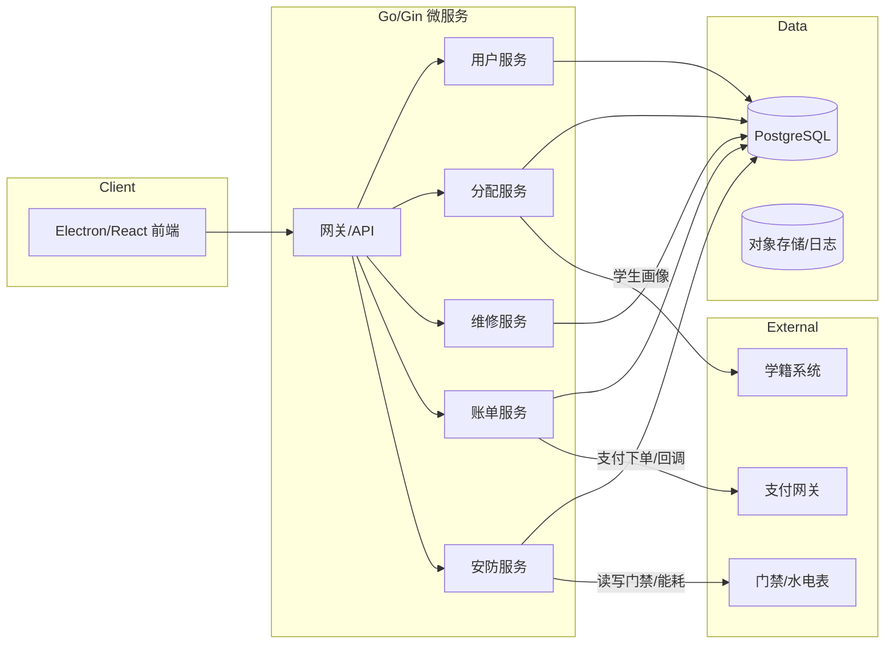
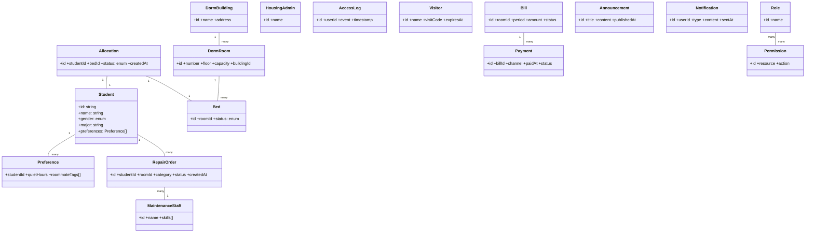
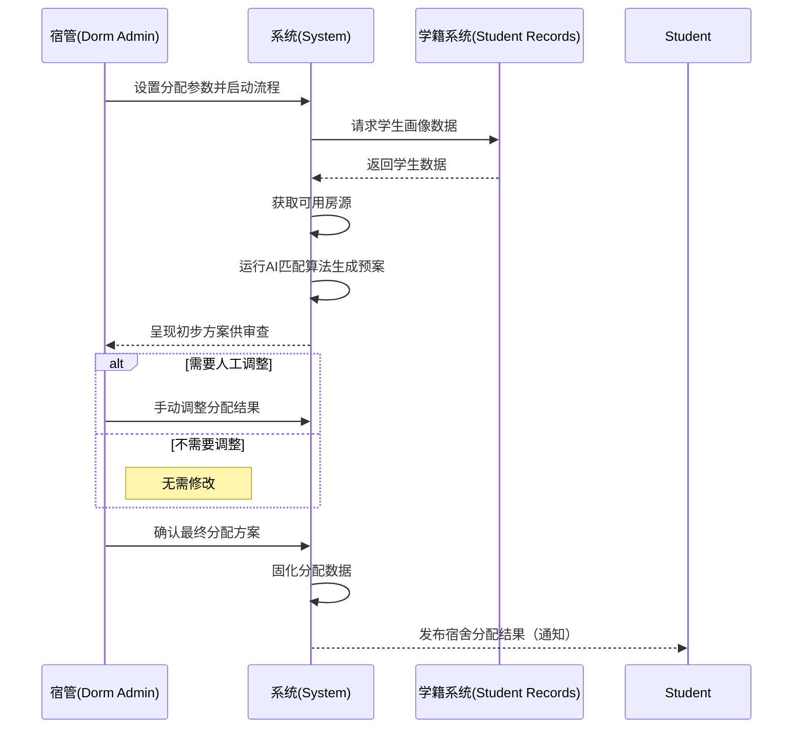
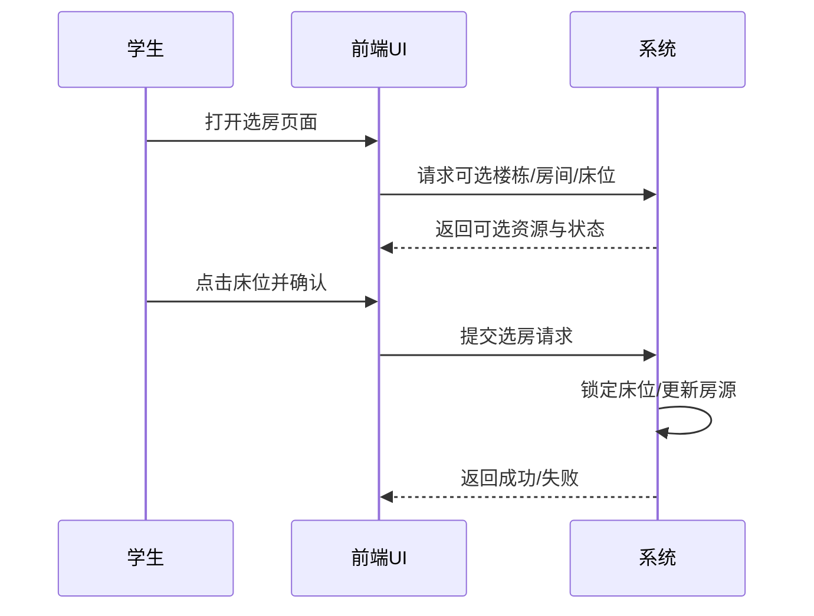

# 智舍宿舍管理系统 — 系统分析（Part II: Analysis Model）

## 1 Introduction（引言，约 500 字）

提示与要求
- 目标重述：简洁重述项目目标与范围，参考 `assignment1/SRS.md` 第 1 章与 `assignment0/Proposal.md` 的“主要目标/核心功能”。
- 进展简述：概述自“需求建模”以来的进度与成果（已完成的 SRS、路线图、关键用例与非功能指标）。
- 变更说明：指出与前一阶段的变更与当前状态（例如：范围微调、优先级调整、接口选型变化）。
- 语言与风格：用词克制、面向审阅者，避免营销式语言；适当量化。

建议结构
- 背景与动机（2–3 句）
- 项目目标与范围（4–6 句）
- 阶段进展与里程碑（2–3 句）
- 变更/当前状态（2–3 句）

---

## 2 Architectural Analysis（架构分析）

产出与格式
- 至少 1 张系统级架构图（UML/SysML/C4 均可），并配文字说明。
- 建议：在 `assignment2/Assignment_2/src/Architecture/` 存放架构图（PNG/SVG），文档内引用。
- 图后紧跟“架构决策说明”（ADR 风格）：关键决策、备选方案、权衡取舍。

写作提示
- 高层视角：前后端分离、微服务、数据库、外部系统（学籍系统、支付网关、门禁/水电表）。
- 映射到技术栈：React + TS + Electron；Go + Gin + Gorm；PostgreSQL；API 边界；消息/实时通道（WebSocket/MQTT）。
- 非功能指标关联：与 `SRS.md` 第 6 章的性能、安全、可维护等目标形成呼应。

示例（占位，后续替换为正式图）
- 若用 C4（PlantUML）：在 `src/Architecture/` 输出 PNG 并引用。
- 若用 UML 组件图（Mermaid），示例骨架：


---

## 3 Analysis Model（领域模型与交互分析）

目标
- 基于已确定的初始架构，输出领域模型（类图）与关键用例交互（时序/协作图）。
- 按用例实现（use case realization）组织，优先覆盖 UC03、UC04、UC06、UC07、UC12 等核心场景。

### 3.1 Domain Model（领域模型：类图）

要求
- 关键类需标注主要职责与重要属性；类间关系明确（关联、组合、继承、枚举）。
- 与 SRS 用语一致（参考第 5 章 Glossary）。

建议类（可增删）
- Student, DormBuilding, DormRoom, Bed, Allocation, Preference
- RepairOrder, MaintenanceStaff, HousingAdmin, AccessLog, Visitor
- Bill, Payment, Announcement, Notification
- Role, Permission, Account, AuthSession

占位骨架（后续替换）


注意
- 属性尽量业务化（避免技术细节）；枚举集中管理（如 `AllocationStatus`）。
- 用例到类的映射关系在子章节中解释。

### 3.2 Interaction Analysis（交互：时序/协作图）

要求
- 至少为以下用例提供时序图：UC03（执行智能分配）、UC04（可视化选房）、UC06（提交报修）、UC07（账单支付）、UC12（访客/门禁）。
- 每个图配 3–6 句文字说明，强调参与者、系统交互与关键决策。

示例占位：UC03 执行智能分配（含合流）


示例占位：UC04 可视化选房


---

## 4 Updated Requirements（需求更新）

要求
- 不改变项目领域；允许范围精化与更新。
- 解释：为什么变更、变更位置、变更内容；与 SRS 的对应关系。

建议表格
- 字段：`需求ID | 变更内容 | 原因 | 影响范围（用例/类/接口/UI） | 验证方式 | 版本/日期`
- 注意语言一致性（术语参考 SRS 的 Glossary）。

---

## 5 Updated UI Snapshots（界面快照 ≥ 5 张）

要求
- 至少五张更新后的 UI 快照，每张配说明（功能目标、交互路径、状态说明）。
- 若含报表/可视化/通知样式，需贴样例。
- 资源路径：`assignment2/Assignment_2/src/UI/`，命名建议 `UI_<模块>_<版本>.png`。

引用示例
```markdown

说明：展示可选楼栋/房间/床位的状态与交互流程，支持偏好筛选。
```

---

## 6 Open Issues（未解决问题）

要求
- 列出下阶段需要探索的挑战与设计任务，按优先级排序。
- 每条包含：问题描述、影响模块、初步方案、阻碍因素、负责人、目标里程碑。

建议分类
- 架构/接口依赖（学籍/门禁/支付）
- 领域模型边界与一致性（类/枚举）
- 性能与容量规划（高并发/峰值）
- 安全与合规（隐私、日志留存）
- 产品体验与可用性验证（P95/P99）

---

## 7 AI Usage & Citations（AI 使用与引用，Optional）

要求
- 若在撰写/图表/探索/编辑中使用了 AI 工具：需在参考列表中引用来源，并在此说明使用范围、审阅与合规。
- 建议内容：
  - 使用场景（文案校对、图表草图、技术检索）
  - 人工复核方法（术语一致性、数据真实性）
  - 产出标记（重要结论标注“AI 参与”）
  - 隐私合规（不含个人敏感信息）

---

## 8 Annotated References（注释型参考文献）

要求
- 为每条参考提供 200–300 字说明：与项目的关联性、使用方式、限制与注意事项。
- 建议包含：标准（29148/4+1/C4）、技术文档（React/Go/PostgreSQL）、领域文章、开源项目（与 Proposal 中三项调研呼应）。

示例骨架
- 参考条目名（作者/出处/链接）
- 注释（200–300 字）：如何指导架构/模型/实现；边界与启示；与本项目的适配性。

---

## 9 Contributions of Team Members（团队成员贡献与分工）

团队成员（参考 Proposal）
- 2252964 张峻搏（组长）
- 2252634 黄毅成
- 2251756 杨光
- 2351707 马敏慧智

分工与交付（建议，可按需微调）
- 张峻搏（组长）
  - 1 引言与 4 需求更新（整合 SRS/Proposal 变更）
  - 9 成员贡献与最终整编、版本控制
  - 交付：引言草稿 v1.0（2025-11-09）；需求变更表 v1.0（2025-11-12）
- 黄毅成（架构与接口）
  - 2 架构分析：系统级架构图 + 决策说明（ADR）
  - 外部系统接口定义与约束（学籍/支付/门禁）
  - 交付：Architecture 图 v1.0（2025-11-10）；ADR 文档 v1.0（2025-11-12）
- 杨光（领域模型与交互）
  - 3.1 领域模型：类图与枚举；职责与属性
  - 3.2 交互分析：UC03/UC04/UC06 时序图
  - 交付：ClassDiagram v1.0（2025-11-11）；Sequence UC03/UC04/UC06 v1.0（2025-11-13）
- 马敏慧智（UI 与参考）
  - 5 UI 快照（≥5）：学生端/宿管端关键页面与通知样例
  - 8 注释型参考文献；7 AI 使用说明（如适用）
  - 交付：UI 资源包 v1.0（2025-11-12）；References 注释 v1.0（2025-11-13）

交叉评审
- 11月14日：全员互评一次（术语一致性、编号、图片路径）
- 11月16日：合入 v1.0，准备 11月17日课堂展示（10分钟）

---

## Submission Checklist（提交检查清单）

- 文档完整：1–9 章节齐备，语言统一、术语一致（参考 SRS Glossary）。
- 模型齐备：架构图、类图、时序图均已导出 PNG/SVG 并正确引用。
- 资源路径统一：`assignment2/Assignment_2/src/<模块>/...`。
- 非功能指标呼应：文中涉及性能/安全/可维护性时，引用 `SRS.md` 第 6 章指标。
- 引用与合规：AI 使用说明（如适用）；注释型参考文献每条 200–300 字。
- 演示准备：10 分钟演示的关键页与讲述节奏（目标→架构→模型→UI→问题→计划）。