# 智舍宿舍管理系统 — 系统分析（Part II: Analysis Model）

## 1 Introduction（引言，约 500 字）

提示与要求
- 目标重述：简洁重述项目目标与范围，参考 `assignment1/SRS.md` 第 1 章与 `assignment0/Proposal.md` 的“主要目标/核心功能”。
- 进展简述：概述自“需求建模”以来的进度与成果（已完成的 SRS、路线图、关键用例与非功能指标）。
- 变更说明：指出与前一阶段的变更与当前状态（例如：范围微调、优先级调整、接口选型变化）。
- 语言与风格：用词克制、面向审阅者，避免营销式语言；适当量化。

建议结构
- 背景与动机（2–3 句）
- 项目目标与范围（4–6 句）
- 阶段进展与里程碑（2–3 句）
- 变更/当前状态（2–3 句）

---

## 2 Architectural Analysis（架构分析）

### 2.1 总体架构设计

1. 展现层 (Presentation Layer)
该层负责处理所有面向用户的交互，是系统的用户界面（UI）部分。它向用户展示信息，捕获用户的输入事件（如点击、表单提交），并将这些操作请求转发给应用服务层进行处理。

2. 应用服务层 (Application Service Layer)
该层作为展现层与领域核心层之间的协调者。它负责编排具体的业务用例流程，管理事务边界和执行权限验证。它通过调用领域服务和持久化接口，来协调完成一个完整的、有状态的业务操作。

3. 领域核心层 (Domain Core Layer)
该层是系统的业务核心，封装了所有纯粹的业务规则、逻辑、实体和状态模型。它独立于任何技术实现细节（如数据库或UI），确保了核心业务逻辑的稳定、可测试和可复用。

4. 数据持久化层 (Data Persistence Layer)
该层提供了将领域对象（如实体）映射到内部数据存储的具体实现。它实现了上层定义的仓储（Repository）接口，负责执行所有与内部数据库和缓存相关的数据查询与增删改操作。

5. 外部集成层 (External Integration Layer)
该层负责处理与所有第三方外部系统的通信。它通过适配器（Adapters）模式封装了与外部API（如校园信息系统、支付渠道、物联网设备）的交互细节，包括协议转换和数据格式映射，为系统内部提供统一的接口。

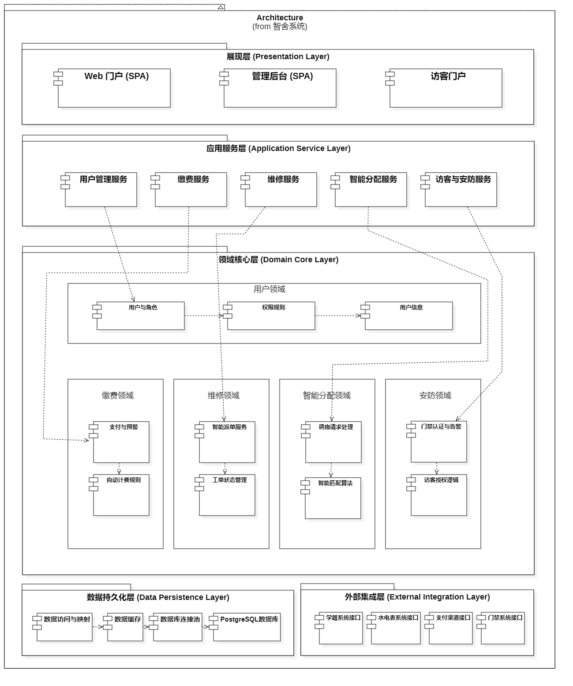

### 2.2 架构图详解

系统架构图详细介绍
本系统采用经典的多层架构，自上而下分为展现层、应用服务层、领域核心层、数据持久化层和外部集成层。这种设计确保了各层职责单一、高度解耦，易于维护和扩展。

#### 2.2.1 展现层 (Presentation Layer)

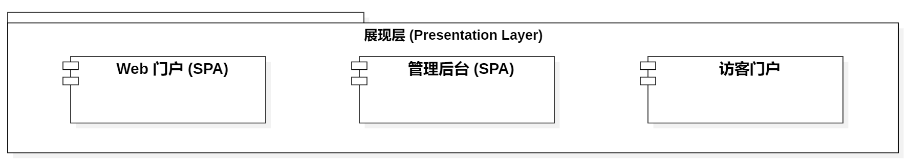

展现层是系统的最顶层，负责所有面向用户的交互和界面展示 (UI)。它捕获用户的输入，并将请求转发给应用服务层进行处理。根据图示，该层针对不同用户群体提供了专属的门户：

Web 门户 (SPA): 一个单页应用程序 (SPA)，面向系统的主要用户（如学生），提供宿舍信息查看、报修、缴费等日常功能。

管理后台 (SPA): 另一个单页应用程序，专用于系统管理人员（如宿管、安保、维修团队）进行后台操作，如分配管理、工单审批、安防监控等。

访客门户: 一个为访客（如学生亲友）提供的独立入口，主要用于访客预约登记和身份确认。

#### 2.2.2 应用服务层 (Application Service Layer)

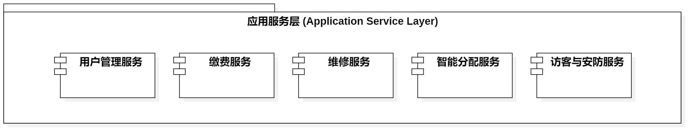
应用服务层是展现层与领域核心层之间的协调者。它不包含核心业务规则，而是负责编排具体的业务用例（Use Case）流程、管理事务边界，并调用一个或多个领域服务来完成一个完整的操作。

该层按业务场景被划分为五个核心服务：

用户管理服务: 负责处理用户登录、注册、权限验证和信息查询等相关流程。

- 缴费服务: 负责协调与费用（如水电费）相关的业务流程，如发起计费、处理支付回调、发送预警等。

- 维修服务: 负责协调所有设备报修、智能派单和维修状态更新的完整流程。

- 智能分配服务: 负责协调宿舍的自动分配和学生的调宿申请流程。

- 访客与安防服务: 负责协调访客预约、门禁访问审批和安全告警等流程。

#### 2.2.3 领域核心层 (Domain Core Layer)

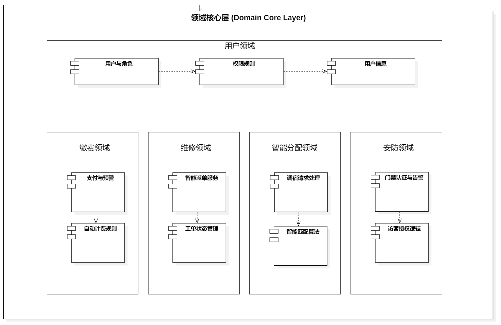
领域核心层是系统的“心脏”，封装了所有纯粹的业务规则、实体、状态和算法。该层独立于技术实现（如数据库或UI），确保了核心业务逻辑的稳定、可测试和可复用。

该层按业务边界被划分为五大领域，每个领域包含其内部的细化职责：

**用户领域**:

- 用户与角色: 定义用户实体和角色实体的业务规则。

- 权限规则: 封装了基于角色（RBAC）的权限判断逻辑。

- 用户信息: 定义用户的个人画像或背景信息模型。

**缴费领域**:

- 支付与预警: 处理支付状态流转和欠费预警的业务规则。

- 自动计费规则: 封装了如何根据用量和单价计算费用的核心算法。

**维修领域**:

- 智能派单服务: 包含了根据维修工技能、位置、负载来自动分配工单的规则。

- 工单状态管理: 负责管理维修工单（如待接单、维修中、已完成、已评价）的生命周期。

**智能分配领域**:

- 调宿请求处理: 封装了学生调宿申请的资格校验、审批流程等业务规则。

- 智能匹配算法: 是宿舍分配功能的核心，定义了如何根据学生画像（如专业、作息）匹配宿舍的算法。

**安防领域**:

- 门禁认证与告警: 定义了谁可以进入、何时进入的认证规则，以及处理异常闯入的告警逻辑。

- 访客授权逻辑: 负责处理访客的预约审批和临时通行凭证的生成规则。

#### 2.2.4 数据持久化层 (Data Persistence Layer)

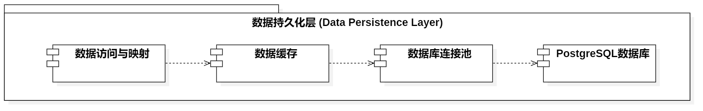
数据持久化层提供了将领域对象（如实体）映射到内部数据存储的具体实现。该层按数据访问的技术功能进行划分，为上层提供了统一、抽象的数据访问接口：

- 数据访问与映射: 负责执行所有的数据查询 (SQL) 和对象关系映射 (ORM)，是仓储模式 (Repository Pattern) 的具体实现。它封装了对数据库的直接操作，实现了领域层定义的接口。

- 数据缓存: 提供高性能的缓存服务（如 Redis），用于存储热点数据。数据访问与映射 组件会调用它以减少数据库压力。

- 数据库连接池: 负责管理与数据库的物理连接，确保数据访问的高效和稳定。

- PostgreSQL数据库: 系统的最终物理数据存储后端。

#### 2.2.5 外部集成层 (External Integration Layer)

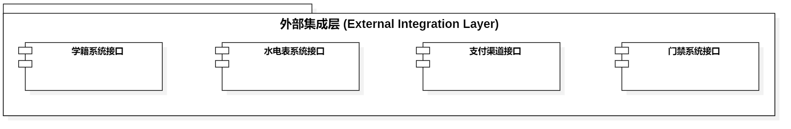
外部集成层是系统与所有第三方外部系统通信的统一出口。它通过“适配器”模式封装了与外部 API 的交互细节（如协议转换、数据格式化），为内部的领域层和应用服务层提供稳定、统一的接口：

- 学籍系统接口: 负责对接学校的学籍系统，以获取学生画像、专业等数据。

- 水电表系统接口: 负责对接物联网 (IoT) 水电表，以读取宿舍的实时用量数据。

- 支付系统接口: 负责对接微信、支付宝等第三方支付渠道，以处理在线缴费。

- 门禁系统接口: 负责与宿舍楼的智能门禁硬件通信，以执行开门或告警指令。

### 2.3 架构决策说明

#### 决策1：采用前后端分离与微服务后端架构
- **关键决策**

前后端分离：采用单页应用（SPA）展现层与后端应用服务层彻底分离的模式。

微服务架构：后端按业务边界划分为多个独立服务，如用户管理、缴费、维修、智能分配、访客安防等。

- **权衡与取舍**


可靠性与容错性：这是关键驱动因素。SRS 明确要求“单个非核心微服务故障不影响核心业务的正常运行” 。微服务架构是实现此目标的基础，避免了单体架构“一处失败，全局崩溃”的风险。


可维护性与扩展性：微服务划分与领域核心层 的限界上下文一致，使团队能独立开发和部署功能。同时，架构支持“水平扩展” ，能满足 SRS 提出的“500个并发用户”  等性能指标。


多端支持：分离的 API 便于复用，为 SRS 中提到的 Web 端 和 Electron 桌面端  提供统一支持。

#### 决策2：数据持久化策略（单库模式）
- **关键决策**


数据库选型：使用 PostgreSQL 作为关系型数据库 。

架构模式：采用“单库”模式。如图所示，所有微服务通过“数据持久化层”访问同一个 PostgreSQL 实例。

- **权衡与取舍**


简化开发复杂度：采用“单库”模式可以避免“库分离”模式带来的分布式事务和数据同步的巨大复杂度，极大简化了开发和数据管理。


保障数据一致性：缴费、分配、维修等核心业务 对事务一致性要求极高。PostgreSQL 提供了强大的 ACID 事务支持，且为团队熟悉的技术栈 。


性能缓解：为缓解“单库”的性能瓶颈，架构中的“数据持久化层”设计了“数据缓存”和“数据库连接池” 组件，以满足响应时间要求。


<!-- 产出与格式
- 至少 1 张系统级架构图（UML/SysML/C4 均可），并配文字说明。
- 建议：在 `assignment2/Assignment_2/src/Architecture/` 存放架构图（PNG/SVG），文档内引用。
- 图后紧跟“架构决策说明”（ADR 风格）：关键决策、备选方案、权衡取舍。

写作提示
- 高层视角：前后端分离、微服务、数据库、外部系统（学籍系统、支付网关、门禁/水电表）。
- 映射到技术栈：React + TS + Electron；Go + Gin + Gorm；PostgreSQL；API 边界；消息/实时通道（WebSocket/MQTT）。
- 非功能指标关联：与 `SRS.md` 第 6 章的性能、安全、可维护等目标形成呼应。

示例（占位，后续替换为正式图）
- 若用 C4（PlantUML）：在 `src/Architecture/` 输出 PNG 并引用。
- 若用 UML 组件图（Mermaid），示例骨架：
-->

## 3 Analysis Model（领域模型与交互分析）

目标
- 基于已确定的初始架构，输出领域模型（类图）与关键用例交互（时序/协作图）。
- 按用例实现（use case realization）组织，优先覆盖 UC03、UC04、UC06、UC07、UC12 等核心场景。

### 3.1 Domain Model（领域模型：类图）

#### 3.1.1用户管理子系统类图
以下是用户管理子系统的类图，边界类为登录、注册、修改密码的表单；控制类负责管理登录和注册行为；实体类为Account用于存储账户信息。

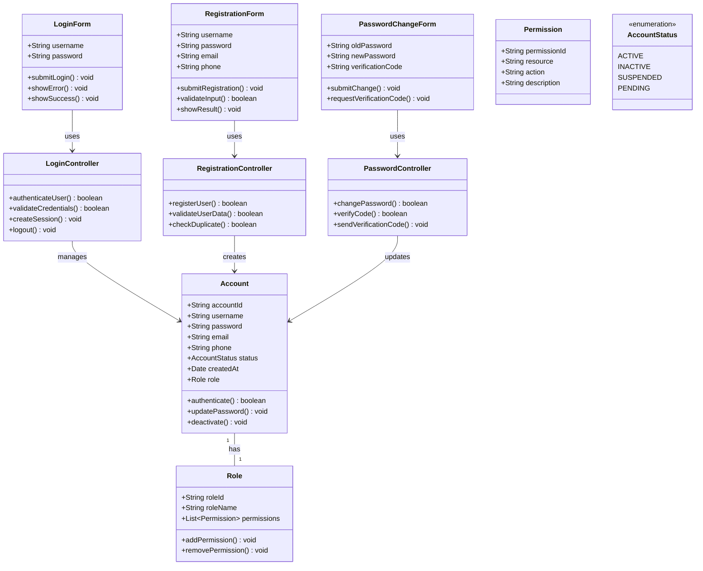

#### 3.1.2宿舍信息子系统类图
以下是用户管理子系统的类图，边界类为登录、注册、修改密码的表单；控制类负责管理登录和注册行为；实体类为Account用于存储账户信息。


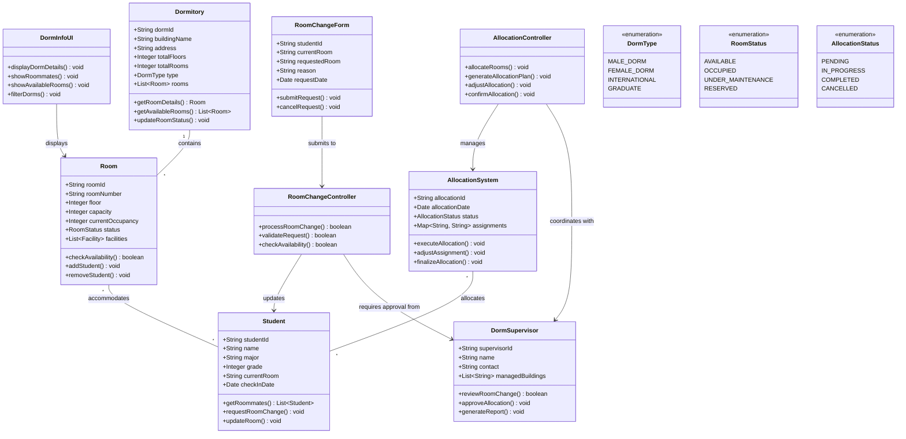

#### 3.1.3设备和维修管理子系统类图
以下是用户管理子系统的类图，边界类为登录、注册、修改密码的表单；控制类负责管理登录和注册行为；实体类为Account用于存储账户信息。
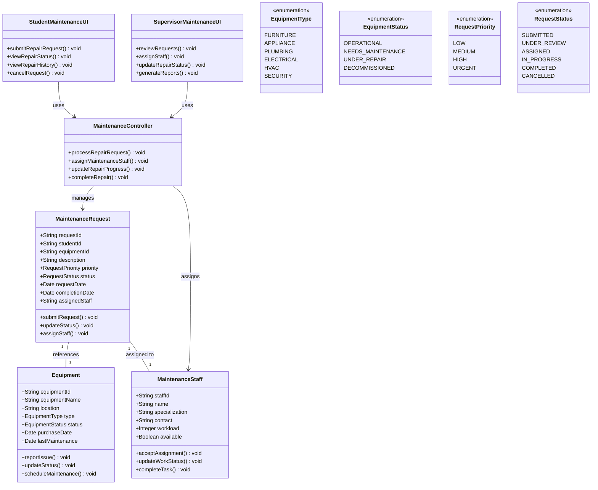
#### 3.1.4缴费管理子系统类图
以下是用户管理子系统的类图，边界类为登录、注册、修改密码的表单；控制类负责管理登录和注册行为；实体类为Account用于存储账户信息。
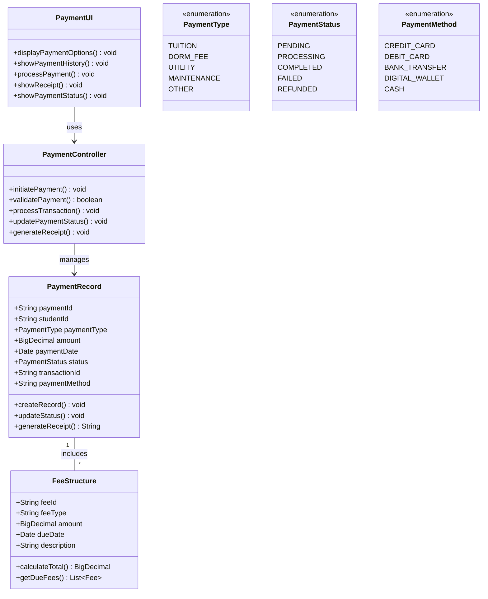
#### 3.1.5公共资源管理子系统类图
以下是用户管理子系统的类图，边界类为登录、注册、修改密码的表单；控制类负责管理登录和注册行为；实体类为Account用于存储账户信息。
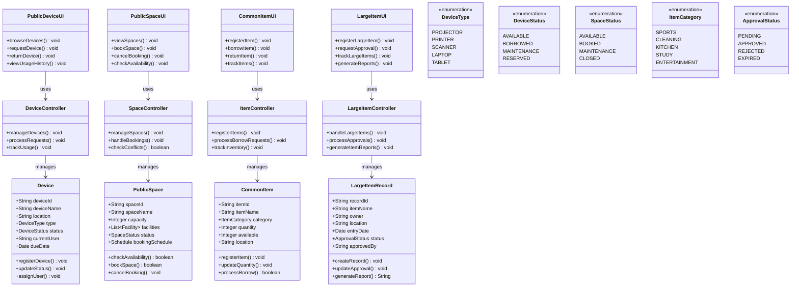


### 3.2 Interaction Analysis（交互：时序/协作图）

#### 3.2.1 注册
这张时序图描述了内部用户进行注册的流程，用户信息将由Account类进行授权，并由RegistrationForm类负责显示注册结果。 
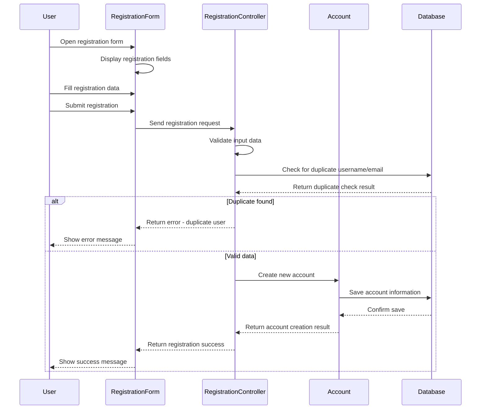
#### 3.2.2 分配宿舍
这张时序图描述了系统分配宿舍的流程。有宿管启动分配，分配系统收到请求后进行宿舍分配，再由宿管调整分配结果，直至宿管确认结果。
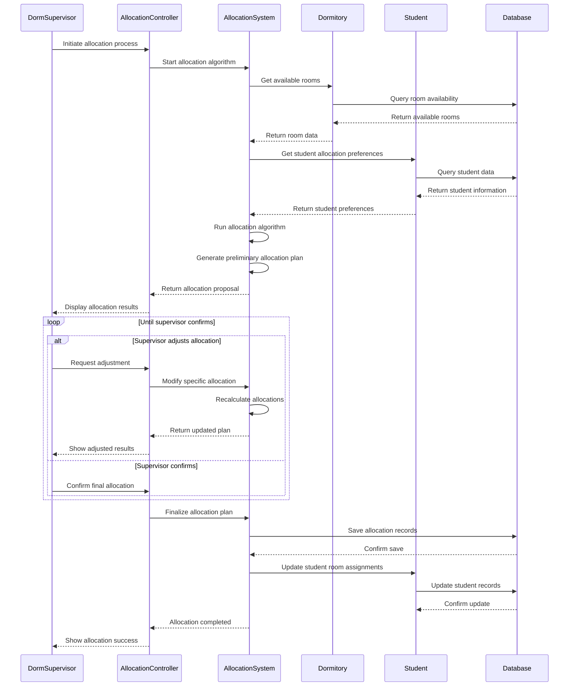
#### 3.2.3 宿舍设备报修
这张交互图描述了学生进行宿舍报修的流程。报修申请将交由宿管审核并分配对应的维修人员，维修人员维修结束后在平台进行反馈，反馈结果将显示在学生端的相应界面上。
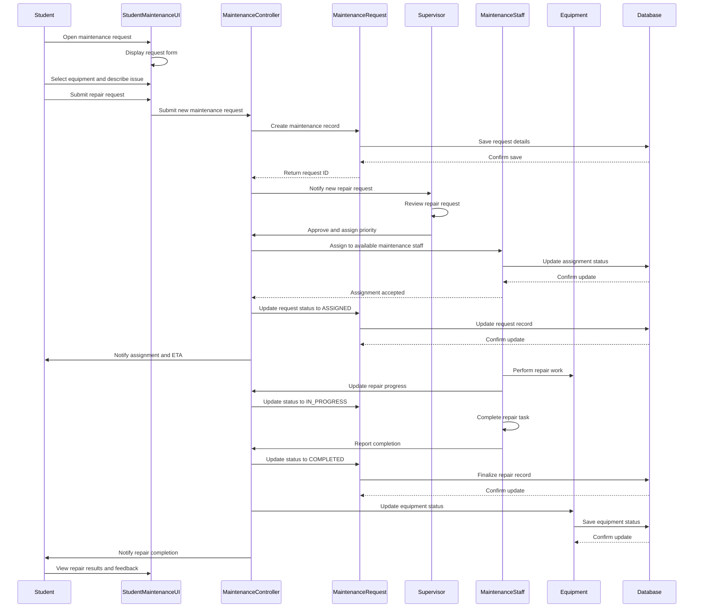
#### 3.2.4 缴费管理
这张交互图描述了学生进行宿舍缴费的流程。学生申请缴费之后会调用支付相关的接口并创建缴费记录，缴费成功与否会在平台进行反馈，反馈结果将显示在学生端的相应界面上。
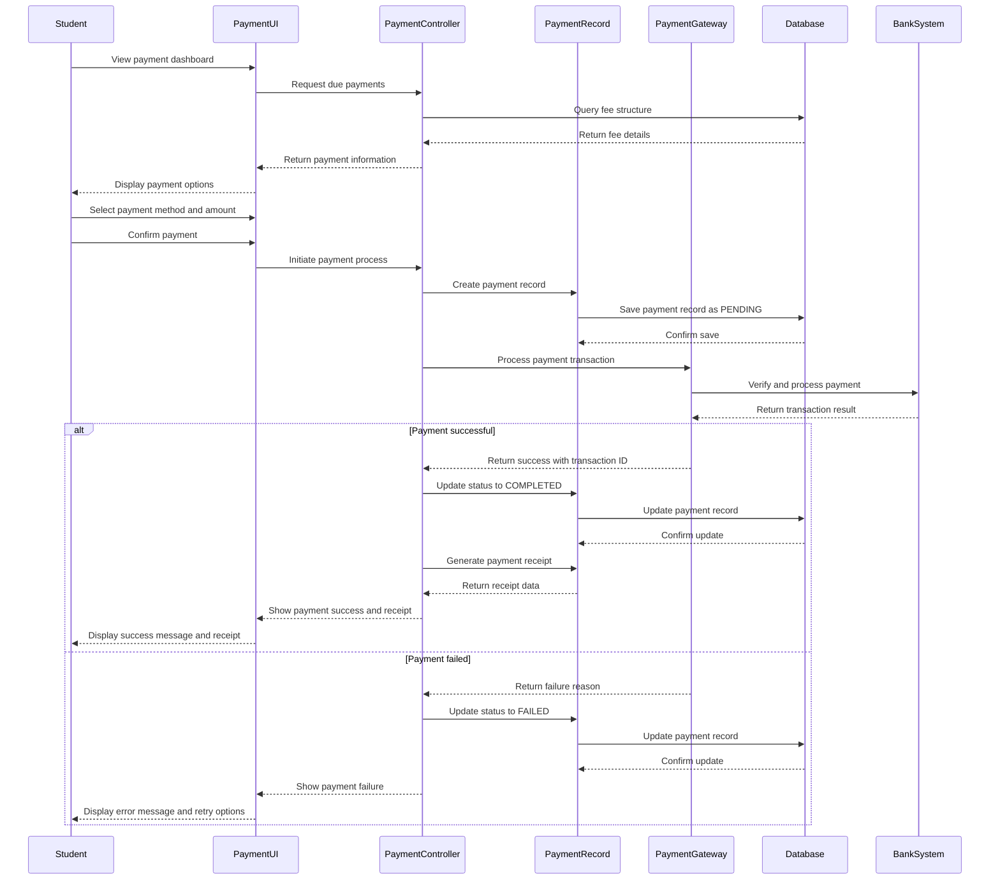
#### 3.2.5 公共物品登记
这张交互图描述了学生进行公共物品登记的流程。公共物品的申请将交由宿管审核并登记，学生归还之后仍然需要宿管进行归还登记，反馈结果将显示在学生端的相应界面上。
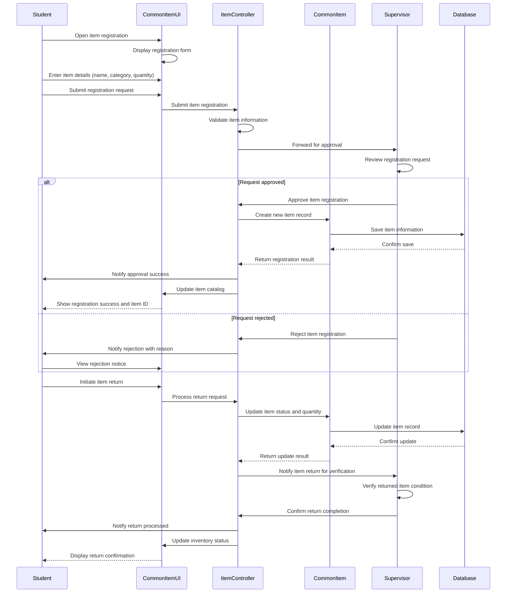


## 4 Updated Requirements（需求更新）

要求
- 不改变项目领域；允许范围精化与更新。
- 解释：为什么变更、变更位置、变更内容；与 SRS 的对应关系。

建议表格
- 字段：`需求ID | 变更内容 | 原因 | 影响范围（用例/类/接口/UI） | 验证方式 | 版本/日期`
- 注意语言一致性（术语参考 SRS 的 Glossary）。

---

## 5 Updated UI Snapshots（界面快照 ≥ 5 张）

要求
- 至少五张更新后的 UI 快照，每张配说明（功能目标、交互路径、状态说明）。
- 若含报表/可视化/通知样式，需贴样例。
- 资源路径：`assignment2/Assignment_2/src/UI/`，命名建议 `UI_<模块>_<版本>.png`。

引用示例
```markdown

说明：展示可选楼栋/房间/床位的状态与交互流程，支持偏好筛选。
```

---

## 6 Open Issues（未解决问题）

要求
- 列出下阶段需要探索的挑战与设计任务，按优先级排序。
- 每条包含：问题描述、影响模块、初步方案、阻碍因素、负责人、目标里程碑。

建议分类
- 架构/接口依赖（学籍/门禁/支付）
- 领域模型边界与一致性（类/枚举）
- 性能与容量规划（高并发/峰值）
- 安全与合规（隐私、日志留存）
- 产品体验与可用性验证（P95/P99）

---


## 7 AI Usage & Citations（AI 使用与引用）

本项目在文档撰写、结构组织与语言校对过程中有限度地使用了 AI 工具（如 ChatGPT，DeepSeek）。AI 的使用仅作为文本生成辅助工具，不参与需求决策、系统架构设计或模型构建。所有内容均由组员进行人工校对，以确保术语一致性、逻辑准确性和内容可验证性。

### **使用场景**

* 文档初稿生成、语言润色与段落结构优化
* 技术文档摘要（React、Go、PostgreSQL）
* 图表描述文本辅助（甘特图、流程图说明用语）
* 用例文字草稿，后续均由组员人工修订

### **人工复核方法**

* 对 AI 生成的文字逐段比对，保证术语、角色命名与用例一致
* 核对技术描述与官方文档保持一致
* 删除未经验证的信息，所有数据均保持为虚构或说明性示例

### **产出标记**

AI 参与部分包括：系统简介草稿、UI 描述草稿、部分战略分析内容。最终内容均由成员完成统一风格和技术核验。

### **隐私与合规**

* 未向 AI 工具输入任何真实学号、身份信息或学校内部数据
* 所有示例数据均为虚构
* 遵守课程“透明标注 AI 辅助来源”的要求

---

## 8 Annotated References（注释型参考文献）


## **[1] ISO/IEC/IEEE 29148:2018 — Systems and Software Engineering — Requirements Engineering**


**注释：**
ISO/IEC/IEEE 29148:2018 是软件与系统工程中使用最广泛的需求工程国际标准，提供了 SRS（软件需求规格说明）的结构组织、需求质量属性、可验证性原则及术语定义。本项目在撰写 SRS 文档时参考了该标准的章节结构，如“Introduction–Use Case–Non-Functional Requirements”等，以确保内容的规范性与一致性。其“需求可追踪性”和“需求一致性”原则对本项目的用例编号、角色命名及流程映射提供了重要指导。需要注意的是，该标准涵盖的范围较大，其中部分如认证要求、复杂安全模型不完全适用于本课程项目，因此仅选取与高校宿舍管理系统相关的部分进行参考。


## **[2] React Documentation — Meta Platforms, Inc.（[https://react.dev）](https://react.dev）)**


**注释：**
React 官方文档系统性描述了组件化开发模式、状态管理、事件处理与 Hooks 使用原则，是本项目前端架构设计的重要依据。宿舍管理系统包含多个独立模块（登录、报修、费用、公告管理等），React 的状态提升、受控组件与组件复用机制为界面分层设计提供了技术指导。文档中的“Thinking in React”章节为本项目 UI 原型与页面结构拆分提供了实践参考。然而 React 文档主要覆盖 UI 技术层面，对权限控制、API 网关、系统安全等不在其范畴的内容仍需结合后端架构设计自行补充。


## **[3] Gin Web Framework Documentation — Gin-Gonic（[https://gin-gonic.com/docs）](https://gin-gonic.com/docs）)**


**注释：**
Gin 是 Go 语言主流的轻量级 Web 框架，其官方文档涵盖路由机制、参数绑定、中间件、错误处理与 JSON 序列化等内容。本项目的 RESTful API 层设计（包括报修、宿舍分配、用户管理、公告管理等接口）均与文档中给出的实践模式一致。Gin 的高性能路由树结构使其适合承载宿舍管理系统中高频接口调用（如公告刷新、报修轮询等）。文档示例清晰，但对于大型系统结构划分、RBAC 权限管理及数据库事务等内容描述有限，因此本项目在相关设计中需额外参考其他工程经验进行补充。


## **[4] PostgreSQL 16 Official Documentation — PostgreSQL Global Development Group（[https://www.postgresql.org/docs/）](https://www.postgresql.org/docs/）)**


**注释：**
PostgreSQL 官方文档涵盖关系建模、索引、事务隔离级别、视图与触发器等功能，是本项目数据库设计与优化的重要参考。本项目的宿舍信息表、报修表、费用表、用户与角色表均基于文档中的规范化设计原则构建。文档对 JSONB、CTE、触发器等特性提供了深入说明，有助于实现复杂查询和后台统计。例如报修处理流程可通过触发器记录状态流转日志。需要注意的是，该文档内容量较大且偏工程化，初学者阅读成本较高，因此本项目仅选取与宿舍管理系统直接相关的部分进行应用。


## **[5] Dormitory-Management-System — GitHub Repository（[https://github.com/TVenkateswaran2002/Dormitory-Management-System）](https://github.com/TVenkateswaran2002/Dormitory-Management-System）)**


**注释：**
该项目是一个开源宿舍管理系统，涵盖学生信息管理、房间分配与费用记录等核心功能。其仓库结构、模块划分、界面布局及 API 职责分离为本项目提供了参考示例。例如，该项目通过分离“学生模块”“管理员模块”实现角色区隔，这与本项目在学生/宿管/维修人员角色划分中的理念一致。尽管其技术栈为 PHP + MySQL，与本项目的 React + Go + PostgreSQL 不同，但其业务流程（入住登记、费用结算、宿舍状态展示）具有一定参考价值。由于该仓库文档较为简略，且缺乏测试与前后端分离设计，因此在本项目中主要作为业务功能参考，而非架构参考。

---


## 9 Contributions of Team Members（团队成员贡献与分工）

团队成员（参考 Proposal）
- 2252964 张峻搏（组长）
- 2252634 黄毅成
- 2251756 杨光
- 2351707 马敏慧智

分工与交付（建议，可按需微调）
- 张峻搏（组长）
  - 1 引言与 4 需求更新（整合 SRS/Proposal 变更）
  - 9 成员贡献与最终整编、版本控制
  - 交付：引言草稿 v1.0（2025-11-09）；需求变更表 v1.0（2025-11-12）
- 黄毅成（架构与接口）
  - 2 架构分析：系统级架构图 + 决策说明（ADR）
  - 外部系统接口定义与约束（学籍/支付/门禁）
  - 交付：Architecture 图 v1.0（2025-11-10）；ADR 文档 v1.0（2025-11-12）
- 杨光（领域模型与交互）
  - 3.1 领域模型：类图与枚举；职责与属性
  - 3.2 交互分析：UC03/UC04/UC06 时序图
  - 交付：ClassDiagram v1.0（2025-11-11）；Sequence UC03/UC04/UC06 v1.0（2025-11-13）
- 马敏慧智（UI 与参考）
  - 5 UI 快照（≥5）：学生端/宿管端关键页面与通知样例
  - 8 注释型参考文献；7 AI 使用说明（如适用）
  - 交付：UI 资源包 v1.0（2025-11-12）；References 注释 v1.0（2025-11-13）

交叉评审
- 11月14日：全员互评一次（术语一致性、编号、图片路径）
- 11月16日：合入 v1.0，准备 11月17日课堂展示（10分钟）

---

## Submission Checklist（提交检查清单）

- 文档完整：1–9 章节齐备，语言统一、术语一致（参考 SRS Glossary）。
- 模型齐备：架构图、类图、时序图均已导出 PNG/SVG 并正确引用。
- 资源路径统一：`assignment2/Assignment_2/src/<模块>/...`。
- 非功能指标呼应：文中涉及性能/安全/可维护性时，引用 `SRS.md` 第 6 章指标。
- 引用与合规：AI 使用说明（如适用）；注释型参考文献每条 200–300 字。
- 演示准备：10 分钟演示的关键页与讲述节奏（目标→架构→模型→UI→问题→计划）。
