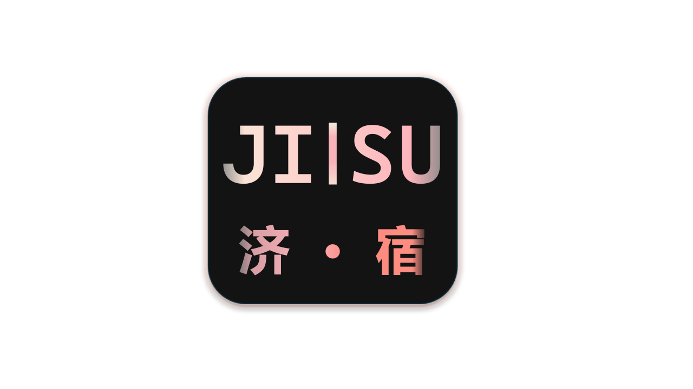

### 济宿——基于智能化与数据驱动的高校宿舍管理系统设计

> [!note]
>
> **课号：42036702**
>
> **时间：周一上午3-4**

> [!important]
>
> **团队名称**：**济宿团队**
>
> **团队成员**：**2252042周政宇(组长)** **2253722张扬** **2250695奥泉瑞** **2252144张立伟**

---

# 项目概述

## 背景及动机

随着数字化转型的推进，高校宿舍管理系统的现代化需求日益增长。然而，许多高校现有系统功能模块分散，缺乏智能化的调度和综合数据分析能力，难以满足相关利益方的多样需求。

基于此背景，我们提出设计并开发一个智能化、高效且数据驱动的高校宿舍管理系统，旨在提升宿舍管理的现代化水平。

---

## 主要目标

- **实现个性化、智能化的宿舍分配**

- **实现高效的设施维护管理**

- **实现透明化的费用管理**

- **实现安全管理与访客监控**

- **实现可视化数据分析与资源优化**

---

## 核心功能与特点

- **定制化、灵活化宿舍分配**：系统将根据学生个人信息（包括但不限于性别、年级、专业及任何特殊需求等）及宿舍使用情况进行智能化的宿舍分配，支持学生提交换宿申请以及自行选择舍友，确保每位同学都能获得适宜的生活环境。

- **便捷的设施维护管理**：学生线上提交设施维修申请，系统根据任务的紧急程度和维修人员的空闲情况进行最优化任务分配，争取最高效率解决同学的需求。学生可全程实时跟踪维修进度，并及时与维修人员进行沟通交流。

- **自动化费用管理**：系统将自动检测并生成住宿费用和水电费账单并发送到学生端，支持学生在线支付，并实时更新缴费记录，使学生的生活账单支付更加便捷。

- **精确化的门禁管理**：实时、精准记录学生的出入信息，全方位监控宿舍楼安全状况，管理临时访客的出入权限，保障学生人身及财产安全。

- **可视化数据统计与分析**：宿管人员可以利用数据分析优化宿舍资源配置，提升整体管理效率。

---

## 目标用户群体和关键可用性目标

### 用户群体：

- **学生**：登记个人信息、查询宿舍分配、提交换宿申请与维修申请、缴纳费用等。
- **宿管人员**：管理宿舍分配、处理学生申请、审核费用缴纳情况、发布宿舍通知等。
- **维修人员**：接收维修任务、更新维修进度、与学生沟通解决问题。
- **安全管理人员**：监控门禁出入情况、审核访客申请、调取监控。
- **外来人员**：提交访客申请。

### 关键可用性目标：

- **用户友好性**
- **高效性**
- **可靠性**
- **安全性**
- **扩展性**
- **建立良好的反馈机制**

---

## 现有类似产品分析

### Roompact

Roompact是一个比较成熟的宿舍和社区管理系统，它主要聚焦于学生社区建设，提供在线社区交流、宿舍生活学习管理、宿舍调解等功能，但在智能化管理和系统集成方面表现较为欠缺。

### StarRez

StarRez支持学生申请宿舍、查看分配情况、在线缴费等基本功能，但对于一些不熟悉基本功能的用户来说显得过于复杂，需要一定的学习时间。

### 同济大学综合服务门户

同济大学综合服务门户为学生提供了种类丰富的服务，但其提供的宿舍相关服务有限，缺少申请更换室友、申请设施维修、数据统计分析等功能。同时，为宿管提供的管理系统存在与学生系统割裂、不易操作、加载速度缓慢等缺点。

---

## 创新点与改进点

- **动态资源调度**：实时调整资源配置，最大化利用宿舍资源。
- **集成化平台**：将宿舍管理功能高度集成到一个系统平台，实现信息共享和流程统一。
- **数据驱动决策**：通过可视化数据分析，优化宿舍管理。
- **简洁直观的UI设计**

---

## 团队组织与项目初步规划

本项目团队由四名大三软件工程专业本科生组成，有一定的项目设计与前后端开发经验，每名成员将根据自身的技术背景和技能优势分配到不同的职责。我们将项目开发流程初步划分为五个阶段：

- **第一阶段：需求分析与系统设计**
  - 进行需求调研，根据利益相关方的实际需求进行系统架构设计，制定技术栈，确定数据库设计与关键数据模型。

- **第二阶段：原型设计与前端开发**
  - 进行前端开发，构建响应式网页设计，并与用户进行原型测试，收集反馈并优化界面。

- **第三阶段：后端开发与数据库集成**
  - 开发宿舍分配等功能模块；实现数据库设计，处理数据的存储与检索；开发API，确保前后端数据交互的顺畅；并初步实现数据加密与角色权限管理机制。

- **第四阶段：集成测试与系统优化**
  - 进行系统的单元测试、集成测试、用户验收测试，修复Bug，进行系统性能优化，并完成安全性测试。

- **第五阶段：系统部署与维护**
  - 部署系统到服务器，并持续监控系统运行情况，处理用户反馈与问题。

---

## 工程流程与方法论

在本项目的开发过程中，我们将采用系统化的工程方法。以下是本项目的核心工程流程和方法论：

- **敏捷开发方法(Agile Approaches)**
  - 为了确保项目能够快速适应需求变化，我们将采用敏捷开发方法，使用两周为一个迭代周期，周期结束后通过评审和回顾不断优化，实现持续交付。
- **面向对象分析与设计(Object-Oriented Analysis and Design,OOAD)**
  - 采用面向对象分析与设计的思想使系统更具可维护性和扩展性，有利于后续功能的迭代和模块的独立开发。

- **面向服务架构(Service-Oriented Architecture, SOA)**
  - 为了确保系统具备较高的扩展性和可维护性，我们将使用面向服务的架构。每个服务负责独立的业务功能，并能够被系统的其他部分调用或复用。

---

## 团队协作平台与工具

我们计划在项目的过程中使用飞书和微信进行沟通和文档撰写，使用**GitHub**进行代码协作，选用**VSCode**、**Intellij IDEA**等集成开发环境进行开发。

------

## 未来发展潜力

未来，本系统可以引入更多创新功能，进一步提高管理效率，增强学生的居住体验：

- **个性化宿舍活动推荐**：根据学生的兴趣爱好和参与记录，智能推荐适合学生的宿舍活动。
- **智能能耗管理**：提供能耗分析与优化建议，帮助学生合理规划生活习惯。

- **跨平台支持与移动端扩展**：开发移动端应用，支持学生随时随地使用。

- **宿舍资源预测与调度**：通过历史数据的积累和实时数据的分析，提前做好资源调度和规划。

------

## 相关技术

- **平台**：Web应用程序（PC端）
- **开发语言**：JavaScript, Java
- **框架**：Vue, SpringBoot 

------

## 项目开发中的挑战

- **用户需求变更**：随着项目的深入开发，不同用户可能会提出新的需求或调整原有功能。因此，团队将采用**敏捷开发方法**，通过短周期的迭代快速交付和反馈，不断优化系统。
- **安全性**：为确保系统能够有效防止未经授权的访问，团队必须实施多层次的安全策略，同时需定期进行安全审查和渗透测试。
- **性能优化**：系统在处理大规模数据时可能面临性能瓶颈，因此需要在架构设计中考虑扩展性与性能优化。

------

# 项目对专业成长的帮助

本项目能够帮助团队成员提升系统分析与设计的能力，学习如何将理论知识应用于实际项目。同时，项目的开发过程将涉及多种前沿技术，有助于提升团队成员在软件开发和项目管理方面的综合能力。

------

#  相关资源

- [Roompact – Residence life and education, residential curriculum and curricular approaches, student housing, and technology.](https://www.roompact.com/)

- [StarRez | Cloud Based Residential Community Management Software Platform](https://www.starrez.com/)
- [一网通办门户 (tongji.edu.cn)](https://all.tongji.edu.cn/all/index.html#/)
