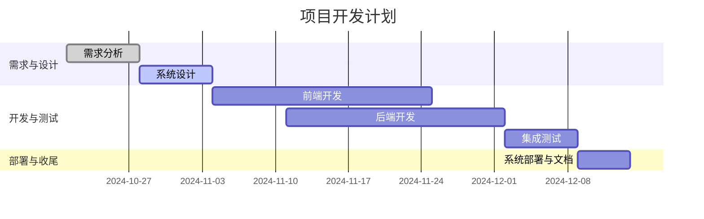

# 智舍 - 新一代智能宿舍管理系统

> [!important]
> **团队名称**：**智舍团队**
>
> **团队成员**：
> 2252964 张峻搏
> 2252634 黄毅成
> 2251756 杨光
> 2351707 马敏慧智

---

## 项目概述

> **提示**: 这部分是对整个项目的宏观介绍，简明扼要地说明项目是做什么的，为什么要做，以及它的核心价值。可以参考 `Project Proposal.md` 的写法，但要用自己的话来组织。

### 背景及动机

> **写作提示**:
> - **现状分析**: 描述当前高校宿舍管理的痛点。可以引用参考文件中提到的“功能模块分散”、“缺乏智能化”、“数据分析能力弱”等问题。
> - **需求增长**: 结合数字化转型的大趋势，说明为什么现代化的宿舍管理系统是必要的。
> - **我们的动机**: 清晰地表达出团队希望通过这个项目解决什么具体问题，达到什么效果。例如：提升管理效率、改善学生住宿体验等。
> - **用语**: 专业、客观，用数据或事实说话会更有说服力。

### 主要目标

> **写作提示**:
> - 使用清晰、可衡量的语言来定义项目目标。
> - 将目标分解为几个核心点，例如：
>   - **实现智能化的宿舍分配**: 强调个性化和效率。
>   - **实现高效的设施维护管理**: 强调流程自动化和信息透明。
>   - **实现透明化的费用管理**: 强调自动化和便捷性。
>   - **实现精细化的安全管理**: 强调实时监控和权限控制。
>   - **实现可视化的数据分析**: 强调数据驱动决策。
> - 每个目标最好都能用一句话概括。

### 核心功能与特点

> **写作提示**:
> - 这是提案的核心部分，需要详细描述系统的具体功能。
> - 对每个`主要目标`，都应该有对应的功能来支撑。
> - **功能描述**:
>   - **智能宿舍分配**: 如何根据学生信息（性别、专业、习惯等）进行匹配，如何处理换宿申请。
>   - **设施维护管理**: 从学生报修->系统派单->维修人员接单->进度跟踪->完成反馈，描述整个闭环流程。
>   - **费用管理**: 自动账单、在线支付、缴费提醒等。
>   - **门禁与安全管理**: 结合人脸识别或校园卡，记录出入，管理访客。
>   - **数据统计与分析**: 为宿管提供哪些维度的可视化图表（如入住率、维修响应时间、水电用量趋势等）。
> - **特点**: 突出我们的系统与众不同之处，可以和技术选型结合起来。例如：
>   - **跨平台桌面端**: "基于`Electron`和`React`，我们提供功能完善、体验一致的桌面客户端，方便管理人员在Windows和macOS上高效工作。"
>   - **高性能后端服务**: "采用`Go`语言及`Gin`框架，确保后端服务在高并发场景下的稳定性和快速响应，特别是在选宿舍等高峰期。"

### 创新点与改进点

> **写作提示**:
> - 在参考文件的基础上，思考我们能做得更好的地方。
> - **技术带来的创新**:
>   - **实时性**: Go的并发特性和WebSocket的结合，可以实现更实时的消息推送（如维修进度、通知公告）。
>   - **桌面端体验**: Electron带来的原生应用体验，比Web端更强大（如系统通知、离线操作等）。
> - **流程上的创新**:
>   - **数据驱动的预测**: 能否基于历史数据预测维修高峰期、水电用量，从而提前准备？
>   - **更灵活的分配策略**: 除了满足基本需求，能否引入更多社交因素，让学生自选标签匹配舍友？
> - **UI/UX的改进**: 设计更现代化、更简洁直观的界面。画一个简单的系统架构图或流程图来辅助说明。

---

## 目标用户群体和关键可用性目标

> **写作提示**:
> - **用户群体 (User Persona)**:
>   - 详细列出所有用户角色：学生、宿管人员、维修人员、校方管理层、访客等。
>   - 为每个角色描述他们的核心需求和使用场景。例如：学生最关心的是操作是否简单、信息是否清晰。宿管最关心的是管理效率是否提升。
> - **关键可用性目标**:
>   - **用户友好性**: 界面直观，学习成本低。
>   - **高效性**: 关键操作（如报修、缴费）步骤少，响应速度快。
>   - **可靠性**: 系统7x24小时稳定运行，数据准确无误。
>   - **安全性**: 用户数据加密，权限控制严格。
>   - **可扩展性**: 方便未来增加新功能模块。

---

## 现有类似产品分析

> **写作提示**:
> - **选择产品**: 至少分析2-3个现有产品。可以沿用参考文件中的`Roompact`、`StarRez`和`同济大学综合服务门户`。
> - **分析维度**:
>   - **功能完整度**: 它们提供了哪些功能？缺少哪些功能？
>   - **优点 (Advantages)**: 它们做得好的地方是什么？
>   - **缺点 (Disadvantages)**: 它们存在哪些问题？（例如：UI老旧、操作复杂、智能化程度低、系统集成度差等）
> - **呈现方式**: 强烈建议使用表格进行对比，一目了然。
>
> | 产品名称 | 主要功能 | 优点 | 缺点 |
> | :--- | :--- | :--- | :--- |
> | Roompact | ... | ... | 智能化不足，集成度低 |
> | StarRez | ... | 功能强大 | 界面复杂，学习成本高 |
> | ... | ... | ... | ... |
>
> - **总结**: 在对比后进行总结，点明我们项目的切入点和优势所在。

---

## 团队组织与项目初步规划

> **负责人**: 我
>
> **写作提示**:
> - **团队介绍**: 简单介绍团队成员的构成和技术背景优势。
> - **项目规划 (Project Planning)**:
>   - 采用阶段划分的方式来展示项目的时间线。参考`Project Proposal.md`的五阶段划分法就很好。
>   - **第一阶段：需求分析与系统设计** (例如：第1-2周)
>     - 任务：确定详细需求、设计系统架构、数据库建模（E-R图）、API设计。
>   - **第二阶段：原型设计与前端开发** (例如：第3-5周)
>     - 任务：UI/UX设计、使用React构建前端界面、开发核心页面。
>   - **第三阶段：后端开发与数据库集成** (例如：第4-6周)
>     - 任务：使用Gin+Gorm开发API、实现业务逻辑、与数据库联调。
>   - **第四阶段：集成测试与系统优化** (例如：第7-8周)
>     - 任务：前后端集成测试、性能测试、Bug修复。
>   - **第五阶段：系统部署与文档撰写** (例如：第9周)
>     - 任务：部署到服务器、准备演示、撰写项目报告。
> - **可视化**: 可以考虑使用Mermaid语法画一个简单的甘特图来表示时间规划。

---

## 工程流程与方法论

> **负责人**: 我
>
> **写作提示**:
> - **开发模型**:
>   - **敏捷开发 (Agile)**: 强调我们将采用迭代式开发，例如每两周一个Sprint。这有助于应对需求变化，并持续交付可用功能。
> - **分析与设计思想**:
>   - **面向对象分析与设计 (OOAD)**: 这是一个经典方法，有助于构建模块化、可维护的系统。
>   - **领域驱动设计 (DDD)**: (可选，但很加分) 可以提及我们将尝试使用DDD的思想来划分业务边界，使后端服务逻辑更清晰。
> - **架构风格**:
>   - **微服务架构 (Microservices Architecture)**: 替代参考文件中的SOA。解释为什么微服务适合我们的项目：`Go`语言天生适合构建轻量、高效的微服务。我们可以将用户管理、宿舍分配、维修管理等拆分为独立的服务，这样可以独立开发、部署和扩展，提高系统的灵活性和容错性。
>   - **前后端分离**: 明确指出我们将采用前后端分离的开发模式。

---

## 团队协作平台与工具

> **写作提示**:
> - **沟通**: 微信
> - **文档与设计**: 飞书文档、Figma (用于UI设计)
> - **代码协作**: **GitHub**
> - **开发环境 (IDE)**: VSCode
> - **项目管理**: 飞书多维表格

---

## 相关技术

> **写作提示**:
> - **前端**:
>   - **开发语言**: JavaScript 
>   - **核心框架**: **React**
>   - **桌面端容器**: **Electron**
>   - **UI库**: Ant Design
>   - **状态管理**:  Zustand
> - **后端**:
>   - **开发语言**: **Go**
>   - **Web框架**: **Gin**
>   - **ORM框架**: **Gorm**
>   - **数据库**: PostgreSQL
> - **其他**:
>   - **API规范**: RESTful API

---

## 未来发展潜力

> **写作提示**:
> - 思考在完成核心功能后，这个系统还能有哪些酷炫的扩展。
> - **智能化升级**:
>   - **引入机器学习**: 预测学生退宿、换宿概率；智能推荐舍友。
>   - **IoT集成**: 与宿舍的智能电表、智能门锁、空调等设备联动，实现真正的智能管理。
> - **生态扩展**:
>   - **移动端App**: 开发原生或PWA移动应用，方便学生随时随地使用。
>   - **社区功能**: 建立宿舍楼内的社交圈子，发布活动，促进交流。

---

## 项目开发中的挑战

> **写作提示**:
> 基本在示例的基础上扩写即可

---

## 项目对专业成长的帮助

> **写作提示**:
> 基本在示例的基础上扩写即可

---

## 相关资源

> **写作提示**:
>   - [Go 语言官方文档](https://go.dev/doc/)
>   - [Gin 框架文档](https://gin-gonic.com/docs/)
>   - [Gorm 文档](https://gorm.io/docs/)
>   - [React 官方文档](https://react.dev/)
>   - [Electron 官方文档](https://www.electronjs.org/docs/latest/)
>   - [Ant Design 文档](https://ant.design/docs/react/introduce)
>   - [Zustand 文档](https://zustand-demo.pmnd.rs/)
>   - [PostgreSQL 官方文档](https://www.postgresql.org/docs/)
> - [Roompact – Residence life and education, residential curriculum and curricular approaches, student housing, and technology.](https://www.roompact.com/)
> - [StarRez | Cloud Based Residential Community Management Software Platform](https://www.starrez.com/)
> - [一网通办门户 (tongji.edu.cn)](https://all.tongji.edu.cn/all/index.html#/)
