# 智舍 - 新一代智能宿舍管理系统

> [!important]
> **团队名称**：**智舍团队**
>
> **团队成员**：
> 2252964 张峻搏
> 2252634 黄毅成
> 2251756 杨光
> 2351707 马敏慧智

---

## 项目概述

### 背景及动机

在“智慧校园”战略加速落地的当下，高校宿舍却仍普遍沿用“烟囱式”架构：学籍、财务、后勤、保卫等系统各自为政，缺乏智能化的调度和综合数据分析能力，难以高效地满足相关利益方的多样需求。 
面对学生个性化住宿需求激增、管理人力成本逐年攀升的双重压力，建设一套“可感知、会思考、能进化”的宿舍数字底座已成刚需。  

为此，智舍团队提出以数据驱动为核心、AI 调度为引擎的新一代智能宿舍管理系统，目标帮助校方实现：  
- 宿舍事务“一网通办”；  
- 维修闭环“分钟级”派单，缩短平均时长；  
- 能耗异常“小时级”预警；  
- 学生住宿满意度提升，助力高校打造“安、畅、暖”的智慧生活新范式。

### 主要目标

   - **构建智能化的宿舍分配体系**
      - 基于多维度学生画像（专业、作息习惯、兴趣偏好等）实现精准匹配
      - 将宿舍分配时间从传统人工模式的3-5天缩短至30分钟内完成
      - 学生满意度提升至90%以上
   - **建立高效的设施维护闭环**
      - 实现报修→派单→维修→反馈的全流程数字化
      - 将平均维修响应时间控制在2小时以内
      - 维修完成率提升至95%以上
   - **打造透明化的费用管理平台**
      - 实现水电费、网费等费用的自动计费与在线支付
      - 缴费周期从7天缩短至即时完成
      - 费用争议率降低80%
   - **构建精细化的安全管理网络**
      - 费通过人脸识别+校园卡双重认证确保出入安全
      - 实现访客管理的全流程数字化追踪
      - 安全事件响应时间缩短至5分钟内
   - **提供数据驱动的决策支持**
      - 为管理人员提供多维度可视化数据看板
      - 基于历史数据的预测性维护和资源调配
      - 管理决策效率提升60%

### 核心功能与特点

 - **智能宿舍分配系统**:
   - **智能宿舍分配**: 基于React+Zustand构建的前端状态管理，实现实时匹配结果预览
   - **多条件筛选**: 支持性别、专业、作息时间、兴趣爱好等多维度条件组合
   - **可视化选房**: 通过Electron桌面端提供直观的楼层平面图选房体验
   - **动态调宿管理**: 基于Go+Gin的高性能API处理大量并发调宿请求
 - **设施维护全流程管理**
   - **一键报修**: 学生通过React构建的现代化界面快速提交维修请求
   - **智能派单**: 系统基于维修人员位置、技能和工单紧急程度自动分配
   - **实时进度追踪**: 利用Go的并发特性实现WebSocket实时推送维修状态
   - **满意度评价**: 维修完成后自动触发评价流程，形成质量闭环
 - **智能化费用管理体系**
   - **自动计费**: 与水电表系统对接，基于PostgreSQL实现精准数据存储
   - **在线支付**: 集成主流支付渠道，通过React构建安全便捷的支付界面
   - **账单管理**: 提供历史账单查询、费用明细分析等功能
   - **欠费预警**: 基于Gin框架构建的RESTful API实现智能提醒服务
 - **综合安防管理平台**
   - **门禁管理**: 人脸识别与校园卡双重认证，确保出入安全
   - **访客预约**: 线上预约审批流程，访客信息数字化管理
   - **异常预警**: 基于规则引擎识别异常出入行为并实时告警
   - **安全报表**: 自动生成安全统计报告，辅助安全管理决策
 - **数据可视化分析中心**
   - **多维度仪表盘**: 使用Ant Design图表组件构建直观的数据可视化
   - **实时数据更新**: 利用Go的高并发特性确保数据实时性
   - **预测分析**: 基于历史数据的趋势预测和智能建议
   - **移动端适配**: 响应式设计确保在Electron桌面端的最佳显示效果

### 创新点与改进点

 #### 技术创新
 ##### 1. 基于Go的高并发架构设计
 - **创新点**：充分利用Go语言的goroutine和channel机制，实现真正的并发处理
 - **技术优势**：相比传统Java/Python方案，Go在相同硬件配置下可支持3-5倍的并发用户数
 - **实际效益**：在选宿舍等高峰时段，系统可稳定支持5000+用户同时在线操作
 ##### 2. Electron带来的桌面端深度集成
 - **创新点**：将Web技术与传统桌面应用优势相结合
 - **技术优势**：支持系统级通知、本地文件操作、快捷键绑定等原生功能
 - **实际效益**：管理人员可在不打开浏览器的情况下快速处理日常事务，工作效率提升40%
 ##### 3. 前后端分离的现代化架构
 - **创新点**：采用清晰的API边界设计，前后端独立开发部署
 - **技术优势**：前端使用React构建丰富的用户交互，后端专注业务逻辑和高性能API
 - **实际效益**：开发效率提升50%，系统维护和升级更加灵活
 #### 流程创新
 ##### 1. 数据驱动的智能预测机制
 - **创新点**：基于历史维修数据预测设备故障概率，实现预防性维护
 - **改进效果**：将被动维修转变为主动维护，设备故障率降低35%
 - **技术支撑**：PostgreSQL的时间序列数据存储和Go的高效数据处理能力
 ##### 2. 个性化的宿舍匹配算法
 - **创新点**：引入多维度匹配因子，超越传统基于专业、性别的简单分配
 - **改进效果**：舍友匹配满意度从传统模式的65%提升至90%以上
 - **技术支撑**：React前端的实时匹配预览和Go后端的快速算法计算
 ##### 3. 全流程的无纸化办公
 - **创新点**：从申请到审批、从报修到评价的全流程数字化
 - **改进效果**：纸质文档使用量减少95%，流程处理时间缩短70%
 - **技术支撑**：Electron的本地文件处理能力和Gin框架的高效API接口
 
 #### 用户体验创新
 ##### 1. 一致性的跨平台体验
 - **创新点**：基于Electron实现Windows、macOS平台的统一用户体验
 - **改进效果**：消除不同操作系统间的体验差异，降低用户学习成本
 - **技术支撑**：Electron的跨平台能力和React的组件化设计
 ##### 2. 实时性的交互反馈
 - **创新点**：利用WebSocket实现关键操作的实时状态更新
 - **改进效果**：用户操作反馈延迟从秒级降低至毫秒级
 - **技术支撑**：Go语言的并发特性和Gin框架的WebSocket支持
 ##### 3. 智能化的操作引导
 - **创新点**：基于用户角色和使用场景的智能化界面适配
 - **改进效果**：新用户上手时间从2小时缩短至30分钟
 - **技术支撑**：React的动态组件渲染和Zustand的状态管理

---

## 目标用户群体和关键可用性目标

**用户群体 (User Persona)**:

- **学生**：能通过桌面端或移动设备快速便捷完成个人信息登记、报修、缴费、查询信息等操作，实时了解报修进度、电费余额、通知公告，也能在线进行宿舍和室友的选择、提交换宿申请。
- **维护人员**：通过移动端接收、查看和处理报修工单，实时更新维修进度，查看个人任务列表和历史维修记录，提高维修效率和响应速度。
- **宿管人员**：通过桌面端管理学生信息、宿舍分配、水电费用和报修工单，发布通知公告，查看数据可视化报表（如入住率、维修效率、能耗趋势），实现对宿舍楼的精细化、数据化管理。
- **安保人员**：通过管理终端或移动设备监控门禁出入记录，管理访客登记与授权，接收异常闯入等安全警报，确保宿舍区域的安全。
- **外来访客**：通过移动端自助完成访客预约，生成临时访问凭证（如二维码），在授权时间和区域内通行，简化登记流程。

**关键可用性目标**:

- **易用性 (Usability)**: 界面直观，交互符合用户习惯，无需培训即可快速上手。
- **高效性**: 关键操作（如报修、缴费）步骤少，响应速度快。
- **健壮性**: 系统具备良好的容错能力，在部分服务异常或网络波动时，核心功能仍能稳定可用，不会轻易崩溃。
- **可维护性**: 采用模块化和分层架构，代码清晰、文档齐全，便于团队协作、功能迭代与长期维护。
- **安全性 (Security)**: 用户数据在传输和存储过程中均加密处理，并建立严格的角色权限控制体系，防止未授权访问和数据泄露。
- **可扩展性**: 方便未来增加新功能模块。

---

## 现有类似产品分析（基于 GitHub 开源项目）

> 以下调研了三款在 GitHub 上公开源码的宿舍/住宿管理系统，从功能、技术、优缺点等角度进行分析与对比，为本项目设计提供参考。

---

### 1. [WadhahEssam / student-housing-management-system](https://github.com/WadhahEssam/student-housing-management-system)
- **简介**：一个基于 React Native 的学生宿舍管理系统，提供学生与管理员端功能，涵盖房间登记、报修与报表管理。  
- **核心功能**：  
  - 学生端：注册房间、提交报修、查看历史记录。  
  - 管理端：房间分配、维修记录、统计报表。  
- **优点**：  
  - 移动端体验良好，结构清晰。  
  - 功能流程完整，覆盖主要住宿场景。  
- **不足**：  
  - 缺乏硬件门禁/传感器集成。  
  - 权限体系较简单，不适合多层角色。

---

### 2. [Syun1208 / dormitory-management-system](https://github.com/Syun1208/dormitory-management-system)
- **简介**：结合硬件验证（人脸识别/指纹）与 Web 界面的宿舍管理系统。  
- **核心功能**：  
  - 房间与入住管理。  
  - 生物识别验证（身份登录/出入控制）。  
  - 访客登记与安全监控。  
- **优点**：  
  - 在安全验证方面创新，强化宿舍出入管理。  
  - 支持较完整的入住流程。  
- **不足**：  
  - 界面与操作交互较基础。  
  - 模块耦合度高，扩展性有限。

---

### 3. [SayanBan / Student-Room-Accommodation-Management-System](https://github.com/SayanBan/Student-Room-Accommodation-Management-System)
- **简介**：基于 PHP + MySQL 的宿舍住宿管理系统，分为管理员端与学生端。  
- **核心功能**：  
  - 管理员管理房间与学生信息。  
  - 学生端选择房间、查看入住状态。  
- **优点**：  
  - 结构简单，部署容易。  
  - 角色分工清晰，逻辑明确。  
- **不足**：  
  - 功能基础，仅实现房间分配与入住登记。  
  - 缺少现代化 UI 与数据可视化。

---

### 对比总结

| 项目 | 技术栈 | 优点 | 不足 |
|------|---------|------|------|
| WadhahEssam / student-housing-management-system | React Native + Node.js | 功能完整，移动端友好 | 缺少硬件与权限扩展 |
| Syun1208 / dormitory-management-system | Java + MySQL + 硬件接口 | 有安全验证创新 | UI 基础、扩展性差 |
| SayanBan / Student-Room-Accommodation-Management-System | PHP + MySQL | 简单易部署，角色清晰 | 功能单一、界面老旧 |

**结论与启示**  
现有开源宿舍管理系统多集中于基础房间与入住管理功能，缺乏智能化与可扩展设计。  
本项目可在以下方面形成差异化优势：  
- **模块化架构**：通过接口层支持门禁与物联网设备接入。  
- **多角色体系**：增加宿管、维修员、学生等多层角色权限管理。  
- **数据可视化与分析**：为管理者提供实时统计与异常检测。  

---

## 团队组织与项目初步规划

本项目团队由四名大三软件工程专业本科生组成，有一定的项目设计与前后端开发经验，每名成员将根据自身的技术背景和技能优势分配到不同的职责。我们将项目开发流程初步划分为五个阶段：

- 团队角色分工：
  - 项目规划与架构设计：负责整体技术路线、系统架构设计、数据库建模与质量保障。
  - 前端开发：负责UI/UX设计、使用React构建前端界面、核心页面开发与交互优化。
  - 后端开发：负责基于Gin+Gorm的API开发、业务逻辑实现与数据库联调。
  - 测试与运维/文档：负责集成测试、性能优化、部署上线与项目文档撰写。

- 项目规划（Project Planning）：
  - 第一阶段：需求分析与系统设计（第1–2周）
    - 任务：明确详细需求、完成系统架构设计、数据库建模（E-R图）、API接口设计与规范制定。
  - 第二阶段：原型设计与前端开发（第3–5周）
    - 任务：完善UI/UX、使用React实现核心页面与组件、搭建路由与状态管理、进行原型评审与迭代。
  - 第三阶段：后端开发与数据库集成（第4–6周）
    - 任务：使用Gin+Gorm开发RESTful API、实现业务逻辑与权限控制、完成数据库表结构与联调、初步数据加密与日志。
  - 第四阶段：集成测试与系统优化（第7–8周）
    - 任务：前后端联调、编写并执行单元/集成测试、性能测试与瓶颈优化、修复缺陷与增强稳定性。
  - 第五阶段：系统部署与文档撰写（第9周）
    - 任务：部署至服务器（容器化或云环境）、准备演示材料与答辩、撰写用户手册与项目报告。

```mermaid
gantt
    title 项目时间规划（按周）
    dateFormat  YYYY-MM-DD
    axisFormat  %m/%d
    section 需求与设计
    需求分析与系统设计       :a1, 2025-10-13, 14d
    section 原型与前端
    原型设计与前端开发       :a2, after a1, 21d
    section 后端与数据库
    后端开发与数据库集成     :a3, after a2, 21d
    section 测试与优化
    集成测试与系统优化       :a4, after a3, 14d
    section 部署与文档
    系统部署与文档撰写       :a5, after a4, 7d
```

---

## 工程流程与方法论

在本项目中，我们将结合业界先进的工程方法与设计思想，确保开发过程的高效、规范与高质量。

- **开发模型：敏捷开发 (Agile)**
    - 我们将采用迭代式的敏捷开发模式，以每两周为一个Sprint周期。这种方法有助于我们快速响应需求变更，通过持续交付可用功能来降低项目风险，并确保最终产品与用户期望高度一致。

- **分析与设计思想**
    - **面向对象分析与设计 (OOAD)**: 我们将运用OOAD思想来构建模块化、可扩展且易于维护的系统。通过合理的抽象和封装，确保代码质量与后续迭代的便利性。
    - **领域驱动设计 (DDD)**: 为应对宿舍管理系统的复杂业务逻辑，我们将引入领域驱动设计的核心思想。通过划分明确的业务边界（限界上下文），使后端服务逻辑更清晰，降低系统耦合度。

- **架构风格**
    - **前后端分离**: 项目将严格遵循前后端分离的开发模式，前端负责用户界面与交互，后端专注业务逻辑与数据服务，通过标准化的API进行通信。
    - **微服务架构 (Microservices Architecture)**: 考虑到Go语言在构建轻量、高效服务方面的天然优势，我们将采用微服务架构。核心业务如用户管理、宿舍分配、维修管理等将被拆分为独立的微服务。这种架构不仅支持独立开发、部署和扩展，还提高了系统的整体灵活性与容错能力。

---

## 团队协作平台与工具

团队采用“微信即时沟通 + 飞书文档沉淀”的双轨机制：  
- **微信**负责日常快速对齐与突发问题秒级响应；  
- **飞书文档**集中管理需求、架构、进度，版本可追溯；  
- **Figma**输出高保真原型，UI 评审直接批注，减少二次返工；  
- **GitHub**主分支保护 + PR 模板 + Actions 自动跑单测，确保代码质量；  
- **VS Code**统一插件与 Snippets，一键格式化、静态检查，降低跨端差异；  
- **飞书多维表格**将 Sprint 任务颗粒度拆到人/天，燃尽图自动更新，风险提前预警。  

多工具深度集成，让信息同频、进度透明、协作丝滑。

---

## 相关技术

本项目将采用业界主流且成熟的技术栈，以确保系统的高性能、高可用性和高可维护性。

-   **前端技术栈 (Frontend)**
    -   **开发语言**: **TypeScript**。提供静态类型检查，在编译阶段即可发现潜在错误，提升代码质量与可维护性。
    -   **核心框架**: **React**。通过组件化开发模式高效构建可复用、可组合的UI，拥有庞大且活跃的社区生态。
    -   **桌面端容器**: **Electron**。将Web应用打包为跨平台桌面客户端，提供原生应用体验和更强的功能（如系统通知）。
    -   **UI 库**: **Ant Design**。提供丰富、高质量的企业级预制组件，显著加快开发速度并保证视觉风格统一。
    -   **状态管理**: **Zustand**。以极简的API提供轻量且强大的状态管理能力，有效避免传统方案的复杂性。

-   **后端技术栈 (Backend)**
    -   **开发语言**: **Go (Golang)**。凭借卓越的并发性能和简洁的语法，非常适合构建高并发、高性能的后端服务。
    -   **Web 框架**: **Gin**。基于Go语言的高性能框架，API设计简洁，能帮助我们快速开发出稳定、高效的RESTful API。
    -   **ORM 框架**: **Gorm**。功能强大的ORM库，通过将结构体与数据库表映射，极大简化数据持久化操作。
    -   **数据库**: **PostgreSQL**。以其高可靠性、数据一致性和丰富的特性而闻名，能胜任复杂的业务数据处理。

-   **其他关键技术**
    -   **API 规范**: **RESTful API**。作为前后端通信的标准，使接口定义清晰、易于理解和扩展。
    -   **容器化**: **Docker**。实现开发、测试和生产环境的一致性，极大简化应用的部署、扩展和运维流程。

---

## 未来发展潜力

> 本项目在初期实现基础管理功能后，可逐步向智能化与生态化方向发展。

### 1. 模块化与分层架构
- 将系统拆分为「学生端」「宿管端」「设备接入层」「数据分析层」等模块。  
- 采用 RESTful API 接口设计，方便未来移动端与 IoT 拓展。

### 2. 硬件与物联网接入
- 对接智能门禁、人脸识别、摄像头、传感器等设备，实现无感签到与安全监控。  
- 使用 MQTT / WebSocket 实现实时数据同步与报警通知。

### 3. 数据分析与智能告警
- 基于入住记录与门禁日志分析宿舍行为模式。  
- 结合 AI 模型进行异常检测（如夜不归宿、能耗异常）。

### 4. 多系统互通
- 对接校园一卡通、教务系统，实现统一身份认证（SSO）。  
- 为学校其他管理系统提供 API 接口与数据服务。

### 5. 用户体验与移动端优化
- 使用现代前端框架（Vue / React）实现响应式界面。  
- 提供移动端小程序或 App，使学生自助操作更流畅。

### 6. 长期发展方向
- 逐步演化为可商业化的 **“智慧宿舍管理平台”**，支持多学校或园区部署。  
- 开放插件接口，允许第三方硬件厂商接入生态系统。

---

## 📘 小结
现有开源产品为基础宿舍管理提供了良好范例，但仍缺少智能化与集成度高的方案。  
本项目可定位为 **“可扩展 + 智能化 + 校园生态融合”** 的新一代宿舍管理平台，通过技术与数据双驱动实现差异化竞争力。

## 项目开发中的挑战
-   **技术实现的复杂性**：本项目采用微服务架构，这对服务边界的划分、服务间的通信与数据一致性提出了较高要求。特别是对于首次深度实践 Go 语言和微服务架构的团队来说，需要投入额外的时间学习和磨合。我们将通过领域驱动设计（DDD）指导服务拆分，并在项目初期搭建好服务治理框架。 

-   **团队协作与沟通成本**：项目涉及前后端、桌面端等多个技术方向，四名成员需要高效协作。前后端接口的定义、联调，以及开发规范的统一都可能成为瓶颈。我们将通过制定详细的 API 文档、统一代码风格规范（ESLint, Prettier）来确保信息同步，降低沟通成本。

-   **系统性能与稳定性保障**：宿舍分配、缴费等场景可能面临瞬时高并发请求，这对后端服务的性能和数据库的承载能力是巨大的考验。我们计划在开发后期进行专门的性能测试和压力测试，找出系统瓶颈并进行针对性优化，确保核心功能在高负载下的稳定运行。

---

## 项目对专业成长的帮助

作为一门系统分析与设计课程的核心实践，本项目的主要价值在于完整地体验和演练从需求到蓝图的全过程。通过这个项目，我们能够将零散的知识点串联起来，学习如何将模糊的用户需求转化为明确的功能规格，进而设计出模块化、可扩展、高可用的系统架构。这个过程将迫使我们深入思考不同技术选型和架构决策背后的权衡，锻炼我们从宏观视角构建复杂系统的设计思维与架构能力。最终，产出的将不仅是一份项目提案，更是一套完整的、经得起推敲的系统设计方案，这将极大地提升我们的软件工程素养和解决复杂问题的综合设计能力。

---

## 相关资源

> **写作提示**:
>   - [Go 语言官方文档](https://go.dev/doc/)
>   - [Gin 框架文档](https://gin-gonic.com/docs/)
>   - [Gorm 文档](https://gorm.io/docs/)
>   - [React 官方文档](https://react.dev/)
>   - [Electron 官方文档](https://www.electronjs.org/docs/latest/)
>   - [Ant Design 文档](https://ant.design/docs/react/introduce)
>   - [Zustand 文档](https://zustand-demo.pmnd.rs/)
>   - [PostgreSQL 官方文档](https://www.postgresql.org/docs/)
> - [Roompact – Residence life and education, residential curriculum and curricular approaches, student housing, and technology.](https://www.roompact.com/)
> - [StarRez | Cloud Based Residential Community Management Software Platform](https://www.starrez.com/)
> - [一网通办门户 (tongji.edu.cn)](https://all.tongji.edu.cn/all/index.html#/)
