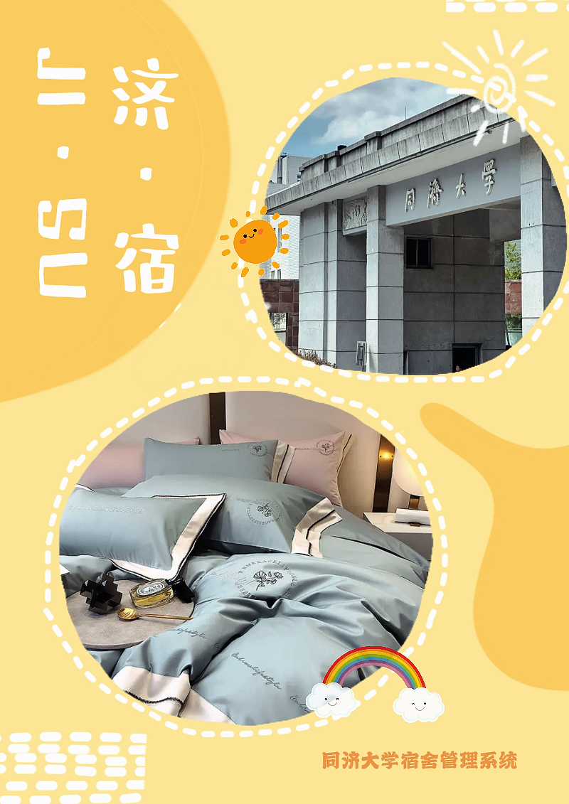

# 目录

[TOC]

# 1 项目简介(Introduction)

## <u>1.1 项目背景</u>

在高校数字化转型的背景下，宿舍管理系统(DMS)的现代化需求日益迫切。当前许多高校宿舍管理系统功能模块分散，缺乏系统集成与智能化的数据分析功能，无法有效满足学生、宿管人员、维修人员等多方的多样化需求。为了解决这些问题，我们设计了一款智能化、高效的数据驱动宿舍管理系统“JISU”，旨在提升高校宿舍管理的现代化水平。

## <u>1.2 项目目的</u>

本系统的主要目标包括实现智能化的宿舍分配、便捷的设施维护管理、自动化的费用管理、精确的门禁安全监控以及可视化的数据分析。通过整合这些功能，我们希望创建一个综合性的宿舍管理平台，以提升管理效率并优化学生的居住体验。

## <u>1.3 系统功能</u>

系统核心功能包括个性化宿舍分配、设施维护管理、自动费用管理、门禁安全监控和数据统计分析。

- 系统会根据学生的个人信息（如性别、年级、专业及特殊需求等）进行智能化宿舍分配，并支持学生提交换宿申请以及选择舍友。

- 对于设施维护，学生可在线提交维修申请，系统会根据任务的紧急程度和维修人员的空闲情况优化任务分配，并允许学生实时跟踪维修进度。

- 此外，系统还将自动生成住宿费用及水电费账单，并提供在线支付功能，使费用管理更加透明和高效。

- 在安全管理方面，系统将精确记录学生出入信息，支持对宿舍楼的全面监控，并管理访客的出入权限，确保学生的安全。同时，系统提供可视化的数据统计与分析功能，宿管人员可通过这些数据优化宿舍资源的配置，从而提升整体管理水平。

## <u>1.4 系统特点</u>

与市场上已有的宿舍管理系统如*Roompact*和*StarRez*相比，本系统的创新点在于高度集成化的功能平台、数据驱动的决策能力以及智能化的资源调度。我们致力于提供一个简洁直观的用户界面和良好的用户体验，使管理工作更加高效且便于操作。

# <u>2 敏捷开发与需求分析(Agile Development and Requirement Analysis)</u>

# 3 用例建模(Use case modeling)

## <u>3.1 参与者(Actor)</u>

在我们的产品中，主要有五种用户群体：

- 管理员：管理员有着最高的权限，能够对所有的信息进行增删改查操作。

- 学生：登记个人信息、查询宿舍分配、提交换宿申请与维修申请、缴纳费用等。

- 宿管人员：管理宿舍分配、处理学生申请、审核费用缴纳情况、发布宿舍通知、审核访客申请等。 

- 维修人员：接收维修任务、更新维修进度、与学生沟通解决问题。 

- 访客：访客是未注册的用户，他们如果要访问宿舍，需要提交访客申请。

## <u>3.2 用例图(Use Case Diagrams)</u>

### <u>3.2.1 整体概览与功能点详解</u>

这是我们产品的整体概览:

**共有用例功能点**

- 登录注册：用户可以在系统上进行实名的身份注册，如学生入学时、宿管等人入职时，后可凭借此身份信息登录系统进行操作。
- 查看公告：用户可在系统上进行登录后，查看宿管人员、系统管理员等发出的公告，方便了解宿舍楼的最新讯息。

**学生用例功能点**

- 个人信息填写（个性化信息）：学生可以填写自己的详细信息，如性别、个人爱好、个人生活习惯等，方便个性化寝室分配。
- 查看宿舍信息：学生可以在系统内查看宿舍空余情况，可以查看宿舍的实拍图片和其他相关信息，供学生自由选择心仪的宿舍。
- 申请换宿舍：学生如对当下的宿舍不甚满意，可于系统内提交换寝室申请，争取为各位同学提供最好的住宿体验。
- 申请维修：学生可以在发生寝室设施故障时在系统上报，申请维修师傅来宿舍修理，尽快解决安全隐患。
- 缴费：学生可以在系统上提交宿舍住宿费、水费、电费等，使这些费用的缴纳流程更加便捷与方便。
- 查看费用账单：学生可以在系统上查看过往以及当月的账单，如过往一月内宿舍用电情况以及相关费用等。
- 查看宿舍公用设备运行状态：学生可以在系统上查看到宿舍公用设备的运行情况，确保自己的使用时间内设备是空闲状态。
- 公共空间使用申请：学生可以在系统上申请各种功能房的使用，如党建活动室、自习室以及琴房等。

**宿管用例功能点**

- 发布宿舍公告：宿管人员可以在系统上发布宿舍公告，如宿舍公用设备维修通知，提醒学生避开此段时间使用等。
- 管理宿舍分配：宿舍人员可以在系统上进行学生宿舍的调控分配，如将生活习惯相似的同学调整到一起。
- 处理学生申请：宿管人员可以在系统上审核并处理学生的换寝室、宿舍维修等申请，并将结果反馈给学生。
- 向维修人员报修：宿管人员可以在系统上向维修人员发送报修信息，便于设施故障得到及时处理，保障宿舍安全。
- 查看账单：宿管人员可以通过系统查看全楼和每个寝室的水电使用与水电费缴纳情况，了解楼内用水用电和宿舍费用缴纳情况。
- 查看宿舍公用设备运行状态：宿管人员可以及时在系统上查看宿舍公用设备运行状态，如若设备出现故障，可以及时发现。
- 登记系统：宿管人员可以在系统上对学生进行出勤登记、宿舍公用物品借出归还登记、大件登记等，了解学生出入楼状况。
- 管理门禁系统：宿管人员可以在系统上进行门禁管理，如为楼内学生开启权限，可以刷卡进门等，保障宿舍安全。
- 管理宿舍安保设备信息：宿管人员可以在系统上对监控等宿舍安保设备进行管理，保障楼内住户财产安全。
- 宿舍远程开关锁：宿管人员可以在系统上进行远程的开关锁，防止学生发生因为未随身携带一卡通而无法打开宿舍门的情况。

**维修人员用例功能点**

- 查看报修信息：维修人员可以及时查看宿舍楼内的报修信息，并及时采取维护措施，解决设备问题。
- 反馈报修信息：维修人员可以在系统内提交维修信息的反馈，及时将设备的维修情况反馈给用户查看。

**外来人员用例功能点**

- 申请访客权限：外来人员可以在系统上提交访客权限申请，获得临时进入楼内的权限，便于保洁人员等进楼工作。

**系统管理员用例功能点**

- 管理用户信息：系统管理员可以在系统内对于用户信息进行增加、删除、更改和查看等操作，管理宿舍楼人员变动。
- 管理缴费情况：系统管理员可以在系统内对于宿舍缴费情况进行增加、删除、更改和查看等操作，管理宿舍楼费用缴纳事宜。
- 管理宿舍信息：系统管理员可以在系统内对于宿舍使用信息进行增加、删除、更改和查看等操作，管理宿舍的调度。
- 管理公告通知：系统管理员可以在系统内对于宿管人员发布的公告进行增加、删除、更改和查看等操作。
- 管理公用设备信息：系统管理员可以在系统内对于楼内公用设备信息进行增加、删除、更改和查看等操作。
- 管理报修信息：系统管理员可以在系统内对于报修信息信息进行增加、删除、更改和查看等操作。
- 管理宿管登记信息：系统管理员可以在系统内对于宿管人员的登记信息进行增加、删除、更改和查看等操作。
- 管理学生申请信息：系统管理员可以在系统内对于学生提交的申请进行增加、删除、更改和查看等操作。
- 管理门禁信息：系统管理员可以在系统内对于门禁权限信息进行增加、删除、更改和查看等操作。
- 管理宿舍安保设备信息：系统管理员可以在系统内对于监控等宿舍安保设备信息进行增加、删除、更改和查看等操作。
- 管理外来人员的访客申请：系统管理员可以在系统内对于外来人员的访客申请信息进行增加、删除、更改和查看等操作。

### <u>3.2.2 子系统用例图与详细用例描述</u>

#### 3.2.2.1 用户管理子系统(User Management Subsystem):

##### 用例名: 注册（UC01）

| **属性** | **描述**                                                     |
| -------- | ------------------------------------------------------------ |
| 用例名   | 注册                                                         |
| 编号     | UC01                                                         |
| 参与者   | 全体用户                                                     |
| 前置条件 | 无                                                           |
| 事件流   | 1. 用户进入注册页面 2. 填写注册信息 3. 默认注册为外来人员 4. 其他用户类型由管理员进行批量注册 |
| 后置条件 | 后台用户信息更新                                             |

---

##### 用例名: 登录（UC02）

| **属性** | **描述**                                                     |
| -------- | ------------------------------------------------------------ |
| 用例名   | 登录                                                         |
| 编号     | UC02                                                         |
| 参与者   | 全体用户                                                     |
| 前置条件 | 无                                                           |
| 事件流   | 1. 用户进入登录页面 2. 输入账号密码 3. 正确输入则登录成功 |
| 后置条件 | 成功登录后，不同用户获得不同权限                             |

---

#### 3.2.2.2 宿舍信息子系统(Dorm Information Subsystem):

##### 用例名: 宿舍信息查看（UC03）

| **属性** | **描述**                                                     |
| -------- | ------------------------------------------------------------ |
| 用例名   | 宿舍信息查看                                                 |
| 编号     | UC03                                                         |
| 参与者   | 学生、宿管                                                   |
| 前置条件 | 已登录且用户类型正确                                         |
| 事件流   | 1. 用户进入宿舍信息查看页面 2. 搜索宿舍 3. 查看宿舍信息 |
| 后置条件 | 无                                                           |

---

##### 用例名: 宿舍分配（UC04）

| **属性** | **描述**                                                     |
| -------- | ------------------------------------------------------------ |
| 用例名   | 宿舍分配                                                     |
| 编号     | UC04                                                         |
| 参与者   | 学生，宿管，宿舍管理系统                                     |
| 前置条件 | 已登录且用户类型正确                                         |
| 事件流   | 1. 宿管开放宿舍分配功能 2. 学生进入宿舍分配页面 3. 选择宿舍 |
| 后置条件 | 后台宿舍信息更新                                             |

---

##### 用例名: 宿舍更换（UC05）

| **属性** | **描述**                                                     |
| -------- | ------------------------------------------------------------ |
| 用例名   | 宿舍更换                                                     |
| 编号     | UC05                                                         |
| 参与者   | 学生，宿管，系统管理员                                       |
| 前置条件 | 已登录且用户类型正确，目标宿舍有空余                         |
| 事件流   | 1. 学生申请更换宿舍 2. 宿管收到申请 3. 宿管确认是否同意 |
| 后置条件 | 宿管同意后，后台宿舍信息更新                                 |

---

##### 用例名: 宿舍设备维修（UC06）

| **属性** | **描述**                                                     |
| -------- | ------------------------------------------------------------ |
| 用例名   | 宿舍设备维修                                                 |
| 编号     | UC06                                                         |
| 参与者   | 学生，宿管，维修人员，系统管理员                             |
| 前置条件 | 已登录且用户类型正确                                         |
| 事件流   | 1. 学生报修设备 2. 宿管核实 3. 宿管通知维修人员 4. 维修人员维修并反馈 |
| 后置条件 | 后台维修信息更新                                             |

---

##### 用例名: 宿舍缴费（UC07）

| **属性** | **描述**                                                     |
| -------- | ------------------------------------------------------------ |
| 用例名   | 宿舍缴费                                                     |
| 编号     | UC07                                                         |
| 参与者   | 学生，宿管，系统管理员                                       |
| 前置条件 | 已登录且用户类型正确                                         |
| 事件流   | 1. 学生缴纳水电费 2. 查看缴费记录 3. 宿管查看所有缴费记录 |
| 后置条件 | 后台缴费信息更新                                             |

---

#### 3.2.2.3 公共资源管理子系统(Public Resource Management Subsystem):

##### 用例名: 公用设备的使用（UC08）

| **属性** | **描述**                                                     |
| -------- | ------------------------------------------------------------ |
| 用例名   | 公用设备的使用                                               |
| 编号     | UC08                                                         |
| 参与者   | 学生，宿管，系统管理员                                       |
| 前置条件 | 已登录且用户类型正确                                         |
| 事件流   | 1. 查看公用设备使用情况 2. 学生预约使用设备 3. 系统管理员修改设备信息 |
| 后置条件 | 后台公用设备信息更新                                         |

---

##### 用例名: 公共空间的使用（UC09）

| **属性** | **描述**                                                     |
| -------- | ------------------------------------------------------------ |
| 用例名   | 公共空间的使用                                               |
| 编号     | UC09                                                         |
| 参与者   | 学生，宿管，系统管理员                                       |
| 前置条件 | 已登录且用户类型正确                                         |
| 事件流   | 1. 查看公共空间使用情况 2. 学生预约使用 3. 系统管理员修改空间信息 |
| 后置条件 | 后台公共空间信息更新                                         |

---

##### 用例名: 公用物品登记（UC10）

| **属性** | **描述**                                                     |
| -------- | ------------------------------------------------------------ |
| 用例名   | 公用物品登记                                                 |
| 编号     | UC10                                                         |
| 参与者   | 学生，宿管，系统管理员                                       |
| 前置条件 | 已登录且用户类型正确                                         |
| 事件流   | 1. 学生使用公用物品 2. 宿管登记物品借出归还 3. 系统管理员修改登记信息 |
| 后置条件 | 后台公用物品登记信息更新                                     |

---

##### 用例名: 大件物品进入宿舍登记（UC11）

| **属性** | **描述**                                         |
| -------- | ------------------------------------------------ |
| 用例名   | 大件物品进入宿舍登记                             |
| 编号     | UC11                                             |
| 参与者   | 宿管，系统管理员                                 |
| 前置条件 | 已登录且用户类型正确                             |
| 事件流   | 1. 宿管登记大件物品 2. 系统管理员修改登记信息 |
| 后置条件 | 后台大件物品登记信息更新                         |

---

#### 3.2.2.4 公告与安全管理子系统(Announcement and Security Management Subsystem):

##### 用例名: 外来人员访客申请（UC12）

| **属性** | **描述**                                                     |
| -------- | ------------------------------------------------------------ |
| 用例名   | 外来人员访客申请                                             |
| 编号     | UC12                                                         |
| 参与者   | 外来人员，宿管，系统管理员                                   |
| 前置条件 | 已登录且用户类型正确                                         |
| 事件流   | 1. 外来人员提交访客申请 2. 宿管审核 3. 系统管理员修改访客申请信息 |
| 后置条件 | 后台访客申请信息更新                                         |

---

##### 用例名: 宿舍公告的发布与查看（UC13）

| **属性** | **描述**                                                     |
| -------- | ------------------------------------------------------------ |
| 用例名   | 宿舍公告的发布与查看                                         |
| 编号     | UC13                                                         |
| 参与者   | 学生，宿管，系统管理员                                       |
| 前置条件 | 已登录且用户类型正确                                         |
| 事件流   | 1. 宿管发布宿舍公告 2. 学生查看公告 3. 系统管理员修改公告信息 |
| 后置条件 | 后台宿舍公告信息更新                                         |

## <u>3.5 活动图(Activity Diagrams)</u>

### 3.5.1 登录和注册

系统内部用户（学生和宿管）初次使用本系统时，需要进行注册，填写学号/工号、姓名、所属学院/管理的宿舍楼、校园邮箱、登录密码等信息。系统验证信息有效后向用户授予权限，用户即可输入学号/工号和密码进行登录。若用户需要更新密码或忘记了原密码，可以申请修改密码。申请提交后，系统会向用户的校园邮箱发送验证码，用户输入收到的验证码即可输入新密码以进行修改。

### 3.5.2 宿舍分配与信息查看

学生登录后，可在系统内填写并更新个人信息，包括个人的生活习惯、兴趣爱好、性格、希望分配到的室友等。之后，在需要进行大面积换宿时，智能分配系统会分析所有学生的信息，自动为离开的学生退宿，同时为新来的学生分配合适的室友与宿舍，并将分配信息发送给宿管。宿管查看分配结果后，若认为需要进行修改（例如部分学生休学、某些宿舍房间无法居住等原因），可对结果进行修改；若认为分配妥当，则直接确认结果。系统将根据最终分配情况更新宿舍分配数据。宿舍分配完毕后，学生可查看自己的宿舍信息，包括宿舍楼、房间号、床位、室友信息等。

### 宿舍更换

学生登录后，如果有更换宿舍的需求，可以申请更换宿舍，宿管接收到学生的换宿申请后，可以选择是否允许宿舍更换，如果允许更换宿舍，后台会更新宿舍分配的信息。

### 设备维修

学生如果发现自己宿舍内的设备（如灯、热水器、空调、马桶等）有损坏情况，可以申请设备维修，宿管收到设备维修申请后，经过核查，把维修信息发送给维修人员，维修人员在维修之后要给出反馈，之后后台要对维修信息进行更新。

### 3.5.3 公共资源的使用

学生可以通过系统查看宿舍的公共资源使用情况，了解自习室、洗衣机等可预约资源的当前状态。如果有符合需求的资源，学生可以选择进行预约。系统会检查资源是否可用，若满足条件，预约成功，系统会更新预约记录。对于需要使用的公共物品或登记大件物品（如大型家具或设备），宿舍管理员会负责完成物品信息的登记，确保资源管理的准确性。

### 3.5.4 访客预约

访客可以通过系统提交访客申请，填写相关的访客信息。宿管会收到申请并确认访客信息的真实性和合理性。确认通过后，系统会自动更新访客信息以便记录和管理。如果宿管不同意申请，则访客申请会被拒绝，流程终止。

### 3.5.5 发布公告

宿管可以编辑并发布宿舍公告，通过系统更新相关的公告信息。公告发布后，学生可以登录系统查看最新的公告内容，确保及时获取宿舍管理的重要通知。系统会自动更新数据，确保公告的准确性与及时性。

# 4 术语表(Glossary of Terms)

**宿舍管理系统 (System)：**
用于管理宿舍管理各个方面的软件平台，包括房间分配、维护和公告。

**管理员 (Admin)：**
具有最高系统访问权限的用户，负责管理和维护整个系统。

**学生(Student)：**
居住在宿舍的系统用户，通过系统查看信息、提交申请并管理其个人与宿舍相关的任务。

**宿舍管理者(Dorm Supervisor)：**
负责监督宿舍、审批请求、管理公告和监控宿舍环境的工作人员。

**访客(Visitor)：**
提交访客申请以进入宿舍的非注册用户。

**维修人员(Maintenance Staff)：**
负责处理学生或宿舍管理者提交的维修请求的用户。

**房间分配(Assign Dormitories)：**
根据可用性、学生偏好和系统智能等因素分配学生到宿舍房间的过程。

**维修请求(Request Maintenance)：**
学生提交的修复宿舍设施问题的请求，如损坏的家具、故障的设备或结构维修。

**访客申请(Request Access)：**
由非居民提交的寻求进入宿舍的许可表格，须经宿舍管理部门批准。

**公告系统(Announcement System)：**
宿舍管理系统内的一个功能，允许宿舍管理者为学生发布通知。

**公共资源管理(Public Resource Management)：**
管理和分配学习室、洗衣设施和公共区域等共享宿舍资源。

**水电费(Water and Electricity Bills)：**
学生作为宿舍住宿的一部分需要支付的公用设施费用，可以在系统内管理和跟踪。

**访问控制(Access Control)：**
一种安全功能，监视学生和访客的出入，确保只有授权人员才能进入宿舍。

**自动费用管理(Automated Fee Management)：**
生成并处理宿舍费用（包括租金、公用设施费及其他费用）的系统功能。

**房间变更请求(Request Dorm Change)：**
学生希望调换宿舍或更换室友提交的请求。

**仪表板(Dashboard)：**
系统中的可视界面，用户可以在此查看相关信息，如维修进度、房间分配状态和公告。

**智能资源分配(Smart Resource Allocation)：**
系统利用人工智能和算法优化宿舍资源的分配，以满足学生的需求和资源的可用性。

**用户认证(Authorize)：**
用户通过用户名和密码验证身份以登录系统的过程。

# 5 附加规格(Supplementary Specification)

本节提供了定义宿舍管理系统“JISU”的性能、可靠性、安全性、可维护性、易用性和设计约束的附加要求和指南。

---

## <u>5.1 性能</u>

- **响应时间：**  
  系统平均响应时间必须保持在 **50 tps/200 ms**，在高负载情况下不应超过 **50 tps/1000 ms**。
  
- **用户容量：**  
  系统必须支持同时超过 **20,000 名常规用户**和 **80,000 名访客**。

- **处理极端情况：**  
  在意外流量激增或系统服务故障的情况下，系统必须能够实现**自动或手动降级**，优先处理关键数据以维持主要功能。

---

## <u>5.2 可靠性</u>

- **错误率：**  
  系统应保持**每千行代码 (KLOC) 少于 10 个错误**的错误密度。

- **正常运行时间：**  
  系统应以 **98% 的正常运行时间**可靠性运行，确保用户的连续可用性。

---

## <u>5.3 安全性</u>

- **数据访问：**  
  只有授权的**管理员**才能访问、维护和修改系统数据。

- **用户认证：**  
  所有用户必须使用**唯一的用户名和密码**进行身份验证，以防止未经授权的访问和潜在攻击。

---

## <u>5.4 可维护性</u>

- **可扩展性：**  
  系统架构必须设计为易于扩展，允许轻松添加新功能和模块。

- **数据备份：**  
  系统必须优先保证**数据完整性**并定期按固定间隔安排数据备份。

- **回滚能力：**  
  在发生关键错误或致命错误时，系统必须能够在**3 小时内**回滚到之前的稳定版本。

---

## <u>5.5 易用性</u>

- **用户友好设计：**  
  平台必须确保普通用户可以**轻松理解和使用**系统，不需要进行大量培训。

- **容错性：**  
  系统必须具有容错性，保证**用户操作错误**不会导致系统崩溃或无法使用。

- **UI 一致性：**  
  用户界面应保持**简单和一致性**，遵循**IBM 的通用用户访问 (CUA)** 标准以实现直观设计。

---

- ## <u>5.6 设计约束</u>
  
  - **跨平台兼容性：** 
    系统必须设计为能够**在多个平台上运行**，确保在不同操作系统和设备上的兼容性和可用性。

---

# 6 界面原型(Mock-up UI)

## <u>6.1 登录</u>

如果用户是外部人员，可以通过游客门户进行访客请求。

## <u>6.2 首页</u>

这是一个宿舍管理系统的用户界面。它具有两个主要部分：**服务大厅**和**个人中心**，还有一个**管理登录**选项。

**信息概览**提供了宿舍主要信息的概述，包括宿舍名称、成员数量、当前电费和维修请求。

**通知**区域突出显示重要更新，而**所有功能**部分提供各种功能，如维修请求、费用支付、宿舍分配、个人信息提交、宿舍信息查询和共享宿舍设施的状态。

## <u>6.3 宿舍分配和交换</u>

- 界面允许用户设置他们的宿舍偏好，包括学习年限、楼栋选择、楼层偏好、床位偏好、卫生习惯、学习时间表和宿舍环境。设置偏好后，用户可以保存它们并启动选择过程。
- 右侧显示匹配用户偏好的可用宿舍房间列表。每个条目包括宿舍号、床位可用情况以及房间环境、清洁度或其他特征的具体说明。用户可以通过点击每个选项旁的“申请”按钮来申请房间。

## <u>6.4 生活费用账单</u>

- 此界面显示与宿舍相关费用的账单概览。总金额以大号字体显示，并分为不同类别，如宿舍费、空调租赁费和电费。

- “支付”按钮允许用户继续支付。
- 在支付部分下面，用户可以查看账单历史记录的详细分解，包括单项费用如宿舍费和空调租赁费。还有一个查看过去支付记录的部分，其中列出了每月支出。

## <u>6.5 维修请求</u>

- 此界面允许用户提交与宿舍相关问题的维修请求。
- 用户填写他们的姓名、宿舍号、所需维修类型，并提供问题的详细描述。一旦所有字段都填写完成，用户可以通过点击表单底部的“提交”按钮来提交请求。

## <u>6.6 公共资源使用</u>

**公共资源使用**界面为用户提供了预约两种资源的功能：洗衣机和自习室。

- **洗衣机预约**：用户可以选择楼层查看该楼层的洗衣机状态。系统显示每台机器的可用性，显示为“可用”、“使用中”或“维护中”。用户可以选择一台可用的机器并预定使用时间段。
- **自习室预约**：用户可以选择位置、日期和时间进行自习室预约。在做出这些选择后，界面会在右侧显示当前自习室的可用性。每个房间的状态显示为“可用”、“占用”或“已预订”。用户可以选择一间可用的自习室并确认他们的预订。

这个统一的界面允许用户在一个地方轻松管理洗衣机和自习室的预订。

# 7 参考文献(List of References)

[1]Dennis, A., Wixom, B. H., & Tegarden, D. (2015). *Systems Analysis and Design: An Object-Oriented Approach with UML* (6th ed.). Wiley.  

- 这本书介绍了使用面向对象方法进行系统分析和设计的过程，以及针对复杂系统开发的详细UML建模技术，提供了理解用例图、活动图和类模型的有价值框架。

[2]Sommerville, I. (2011). *Software Engineering* (9th ed.). Pearson Education.  

- 提供关于软件工程实践的全面指南，包括系统可靠性、性能指标和设计约束。

[3]Pressman, R. S., & Maxim, B. (2014). *Software Engineering: A Practitioner's Approach* (8th ed.). McGraw-Hill Education.  

- 讨论了软件开发模型、安全要求和大规模系统的可维护性。

[4]IBM. (1999). *IBM Common User Access (CUA) Guidelines.*  

- 制定了用户界面设计的标准，以促进易用性、一致性和容错性。

[5]Myers, G. J., Sandler, C., & Badgett, T. (2011). *The Art of Software Testing* (3rd ed.). John Wiley & Sons.  

- 重点介绍软件测试技术，包括保持低错误率和确保系统可靠性的方法。

[6]Bass, L., Clements, P., & Kazman, R. (2012). *Software Architecture in Practice* (3rd ed.). Addison-Wesley.  

- 解释了创建可维护和可扩展软件系统的架构原则，重点关注性能和安全性。

[7]Jansen, A., & Bosch, J. (2005). *Software Architecture as a Set of Architectural Design Decisions.* Proceedings of the 5th Working IEEE/IFIP Conference on Software Architecture (WICSA'05).  

- 讨论了影响系统可维护性和可扩展性的设计决策。

[8]ISO/IEC. (2001). *ISO/IEC 9126-1: Software Engineering – Product Quality – Part 1: Quality Model.* International Organization for Standardization.  

- 提供评估软件质量属性的国际标准，包括可用性、性能和可靠性。

[9]LaToza, T. D., & Myers, B. A. (2010). *Developers Ask Reachability Questions.* ICSE '10: Proceedings of the 32nd ACM/IEEE International Conference on Software Engineering, Volume 1.  

- 解决了软件维护中的常见挑战，并介绍了改善系统容错性和设计约束的策略。

# 8 团队成员贡献(Contributions of Team Members)

在完成这项任务的过程中，所有团队成员都积极参与讨论，并努力完成各自的任务。我们的团队成员合作融洽，遇到问题时能及时沟通和解决。小组内的分工均匀且明确，具体如下：

- **项目简介：**
  项目简介部分由张扬同学完成。
- **敏捷开发与需求分析：**
  敏捷开发与需求分析部分由周政宇同学完成。
- **用例建模：**
  用例建模部分中，总体用例图由张扬同学完成，功能点的详细描述由张力伟同学完成，用例描述表由奥泉瑞同学完成，剩余各细分用例图以及各活动图由小组成员均分完成。
- **术语表：**
  术语表部分由周政宇同学完成。
- **附加规格：**
  附加规格部分由周政宇同学完成。
- **界面原型：**
  界面原型部分由周政宇同学完成。
- **参考文献：**
  参考文献部分由周政宇同学完成。
- **团队成员贡献：**
  团队成员贡献部分由奥泉瑞同学完成。
