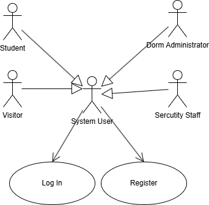

# 智舍（JISU）宿舍管理系统 — 软件需求规格说明书（SRS）模板

> 用法：按各节提示撰写；所有图请放在 `assignment1/Assignment_1/src/` 下相应子目录，并在文中以相对路径引用。术语、用例编号、角色命名在全篇保持一致。

## 1 Introduction（简介，400–800字）
- 写作目标：概述产品愿景、问题背景、拟解决的核心痛点与价值。
- 内容要点：
  - 背景与动机：高校宿舍管理的现状与痛点（系统割裂、调度低效、数据利用不足）。
  - 项目目标与范围：本系统覆盖的主要场景（分配、报修、费用、安防、数据分析）。
  - 预期用户与受益：学生、宿管、维修、安保、访客。
  - 假设与约束：平台（Web/Electron）、技术栈（TS/React、Go/Gin、PG）、合规与隐私。
- 写作建议：使用陈述语气、避免营销化；首段提出价值主张，末段给出结构预告。

## 2 Strategic Analysis（战略分析）
- 交付物：SWOT 与 TOWS 分析，总结业务目标与举措。
- 写作结构：
  - SWOT：每象限2–4点，聚焦事实与证据（如竞品、资源、风险）。
  - TOWS：从机会/威胁出发，制定SO/WO/ST/WT策略各2–3条。
  - 业务目标与关键举措：用KPI/里程碑表达（如入住率提升、报修SLA）。
- 注意事项：避免空泛，策略要能落到后续路线图与用例上。

## 3 Roadmap（路线图）
- 交付物：敏捷或MVP路线图，可用文字或 Mermaid Gantt 表达。
- 建议结构：
  - 阶段划分：MVP1/MVP2/正式版；对应核心能力与验收标准。
  - 时间盒与里程碑：起止日期、可交付物、风险与缓冲。
  - 关联测试与验收：每阶段对应验证方式（Demo、用例覆盖、性能基线）。
- 图示建议：
  - 若使用 Mermaid：在 Markdown 预览中验证；导出PDF时可考虑预渲染为SVG后嵌入。
- 风格：简洁、以结果为导向；避免过度细化到任务级。

## 4 Use Case Modelling & Business Process Modelling（用例与业务流程）

### 4.1 参与者（Actor）
**主要参与者 (Primary Actors)**:

- 学生 (Student): 宿舍的主要使用者，系统服务的主要对象。

- 宿管 (Housing Administrator): 负责宿舍分配、审批、费用和维护流程的日常管理。

- 维修人员 (Maintenance Staff): 负责接收工单并执行具体的维修任务。

- 安保 (Security Staff): 负责门禁、访客和异常事件的管理。

- 访客 (Visitor): 需要进入宿舍楼的外部人员。

- 系统管理员 (System Administrator): 负责系统的后台配置、账户管理和规则设定。

**外部系统/辅助参与者 (External/Secondary Actors)**:

- 学籍系统 (Student Records System): 提供学生画像数据。

- 水电表系统 (Utility Meter System): 提供实时的水电用量数据。

- 支付渠道 (Payment Gateway): 处理在线支付请求。

### 4.2 用例图 (Use Case Diagrams)

#### 4.2.1 整体概览与功能点详解

**学生相关功能**

- 学生是系统的主要用户，功能涵盖住宿、报修、缴费和安防。

- 登录: 学生使用账号密码进入系统。

- 注册: 学生首次使用时创建自己的系统账号。

- 选择房间: 学生在可选范围内直观地挑选自己的宿舍房间。

- 筛选宿舍条件: 学生根据个人习惯（如作息、专业）设置住宿偏好。

- 提交调宿申请: 学生因故需要更换宿舍时，向宿管发起线上申请。

- 提交报修: 学生发现设施损坏时，通过系统快速提交维修请求。

- 追踪维修进度: 学生实时查看自己提交的报修单目前正处于哪个处理阶段。

- 在线支付: 学生通过系统缴纳水电费、网费等宿舍相关费用。

- 接收欠费预警: 当学生账单逾期未缴时，系统会自动发送提醒通知。

- 管理账单: 学生查询自己的历史缴费记录和待缴账单详情。

- 提交访客预约: 学生为即将到访的亲友进行线上预约登记。

- 处理认证: 学生通过刷卡或人脸识别等方式通过宿舍门禁。

**宿管相关功能**
- 宿管是系统的核心管理人员，负责分配、运维、账单和安防的全局管理。

- 登录: 宿管使用其管理员账号进入系统后台。

- 注册: 宿管首次使用时创建自己的管理员账号。

- 执行智能分配: 宿管启动系统，利用算法为（例如新生）批量匹配和安排宿舍。

- 管理调宿申请: 宿管查看和管理所有学生提交的调宿申请列表。

- 审批调宿申请: 宿管对学生的调宿申请进行“批准”或“驳回”的操作。

- 监控维修闭环: 宿管在后台查看所有维修工单的状态和维修人员的效率。

- 管理账单: 宿管查看所有宿舍的缴费状态，并可进行（例如自动计费的）管理。

- 处理访客登记: 宿管审批或管理学生提交的访客预约申请。

- 管理安防报表: 宿管查看和导出宿舍楼的出入记录、异常告警等统计报告。

**维修人员相关功能**
- 维修人员是维修闭环的执行者，负责处理具体的维修任务。

- 登录: 维修人员使用其工号账号登录系统（通常是移动端）。

- 注册: 维修人员首次使用时创建自己的工勤账号。

- 接收工单: 维修人员接收由系统（或宿管）派发的维修任务。

- 更新维修状态: 维修人员在维修的不同阶段（如出发、维修中、已完成）更新工单进度。

**安保相关功能**
- 安保是宿舍安全的负责人，管理门禁、访客和异常事件。

- 登录: 安保人员使用其账号登录安防管理后台。

- 注册: 安保人员首次使用时创建自己的安防账号。

- 处理访客登记: 安保人员在门岗处核验或审批访客的预约信息。

- 处理认证: 安保人员管理门禁系统，处理学生或访客的出入认证流程。

- 响应异常预警: 当系统检测到如尾随、强行闯入等异常时，安保人员会收到告警并前去处理。

- 管理安防报表: 安保人员查看和导出宿舍楼的出入记录、异常事件等统计报告。

**访客相关功能**
- 访客是系统的外部人员，仅能在授权后进入宿舍。

- 处理认证: 访客在预约被批准后，使用获得的临时凭证（如二维码）通过宿舍门禁。

#### 4.2.2 子系统用例图与详细用例描述

##### 用户管理系统

###### 用例名: 登录 (UC01)

| **属性** | **描述** |
| :--- | :--- |
| 用例名 | 登录 |
| 编号 | UC01 |
| 参与者 | 学生, 宿管, 维修人员, 安保 (及其他所有需认证的系统用户) |
| 前置条件 | 1. 参与者已拥有一个系统账号 (已执行过 UC02)。 2. 参与者已打开系统登录界面。 |
| 事件流 | 1. 参与者输入用户名 (或学号/工号)。 2. 参与者输入密码。 3. 参与者点击“登录”按钮。 4. 系统验证凭据是否正确。 5. 系统根据参与者角色（学生、宿管等）授予相应权限并创建会话。 6. 系统跳转到该角色的功能主页。 |
| 后置条件 | 1. 参与者成功登录系统，可以访问其权限范围内的功能。 |
| **扩展场景** | 4a. 用户名或密码错误。  4a1. 系统在登录页面提示“用户名或密码不正确”。  4a2. 参与者可选择重新输入，用例结束。 |

###### 用例名: 注册 (UC02)

| **属性** | **描述** |
| :--- | :--- |
| 用例名 | 注册 |
| 编号 | UC02 |
| 参与者 | 学生, 宿管, 维修人员, 安保, (或 系统管理员) |
| 前置条件 | 1. 参与者尚未拥有系统账号。 |
| 事件流 | **[场景A: 内部用户批量注册 - 主要流程]** 1. `系统管理员` (参与者) 登录后台管理系统。 2. `系统管理员` 访问“用户管理”模块。 3. `系统管理员` 通过批量导入（如Excel）或与学籍/人事系统对接的方式，为 `学生`, `宿管`, `维修人员`, `安保` 批量创建账号并分配初始密码和角色。  **[场景B: 临时用户自主注册 - 次要流程]** 1. 临时用户（如 `访客`）进入注册页面。 2. 用户填写注册信息（如手机号、姓名、设置密码）。 3. 系统创建账号，默认为权限受限的“访客”或“待审核”角色。 |
| 后置条件 | 1. 系统中为新用户创建了账号信息和角色权限。 |

##### 智能分配系统

###### 用例名: 执行智能分配 (UC03)

| **属性** | **描述** |
| :--- | :--- |
| 用例名 | 执行智能分配 |
| 编号 | UC03 |
| 参与者 | 宿管 |
| 前置条件 | 1. 宿管已登录系统 (UC01)。 2. 待分配的学生数据已准备好。 3. 宿舍房源数据已准备好。 |
| 事件流 | 1. 宿管进入“智能分配”模块，选择要分配的学生批次。 2. 宿管设置分配规则（如"同专业优先"、"尊重偏好"）。 3. 宿管启动分配。 4. 系统自动包含并执行 `UC03A 获取学生画像`。 5. 系统根据算法和学生画像数据，运行匹配程序。 6. 系统生成分配预案并呈现给宿管。 7. 宿管审查并（可选）微调预案。 8. 宿管确认并执行分配。 |
| 后置条件 | 1. 该批次学生被分配到宿舍，数据更新。 |

###### 用例名: 获取学生画像 (UC03A)

| **属性** | **描述** |
| :--- | :--- |
| 用例名 | 获取学生画像 |
| 编号 | UC03A |
| 参与者 | 系统 (由 `UC03` 自动触发), 学籍系统 |
| 前置条件 | 1. `UC03 执行智能分配` 被触发。 2. `学籍系统` 接口可用。 |
| 事件流 | 1. 系统接收到 `UC03` 的数据请求。 2. 系统调用 `学籍系统` 的接口，请求目标批次学生的画像数据（专业、生源地、偏好等）。 3. `学籍系统` 返回数据。 4. 系统将数据提供给 `UC03` 的分配算法使用。 |
| 后置条件 | 1. `UC03` 的分配算法获取了所需的数据。 |

###### 用例名: 可视化选房 (UC04)

| **属性** | **描述** |
| :--- | :--- |
| 用例名 | 可视化选房 |
| 编号 | UC04 |
| 参与者 | 学生 |
| 前置条件 | 1. 学生已登录系统 (UC01)。 2. 系统已开放“自主选房”或“调宿选房”功能。 |
| 事件流 | 1. 学生进入“可视化选房”界面。 2. 系统显示学生可选楼栋的楼层平面图和床位状态（如"可选"、"已占用"）。 3. 学生点击一个“可选”床位。 4. 系统显示该床位及同宿舍已有成员的（脱敏）信息。 5. 学生确认选择该床位。 6. 系统锁定该床位，更新学生宿舍信息。 |
| 后置条件 | 1. 学生成功预定或分配到新床位。 2. 宿舍房源信息更新。 |
| **扩展场景** | 5a. 在学生确认的瞬间，床位被他人抢占。  5a1. 系统提示“手慢了，床位已被占用”，要求学生重新选择。 |

###### 用例名: 筛选宿舍条件 (UC05)

| **属性** | **描述** |
| :--- | :--- |
| 用例名 | 筛选宿舍条件 |
| 编号 | UC05 |
| 参与者 | 学生 |
| 前置条件 | 1. 学生已登录系统 (UC01)。 2. 学生处于“智能分配”信息采集阶段，或 `UC04` 选房时。 |
| 事件流 | 1. 学生进入“住宿偏好设置”或“条件筛选”页面。 2. 学生设置多维度条件（如：作息时间"早睡"、"晚睡"；兴趣爱好"运动"、"阅读"；专业"同专业优先"等）。 3. 学生保存偏好。 4. (在 `UC04` 中) 系统根据条件高亮显示符合偏好的宿舍。 5. (在 `UC03` 中) 系统将此偏好作为分配算法的输入。 |
| 后置条件 | 1. 学生的住宿偏好被保存到其个人画像中。 |

###### 用例名: 提交调宿申请 (UC06A)

| **属性** | **描述** |
| :--- | :--- |
| 用例名 | 提交调宿申请 |
| 编号 | UC06A |
| 参与者 | 学生 |
| 前置条件 | 1. 学生已登录系统 (UC01)。 2. 学生当前已有分配好的宿舍。 3. 系统处于允许调宿的时间窗口。 |
| 事件流 | 1. 学生进入“我的宿舍”并选择“调宿申请”。 2. 学生填写申请表格（如：调宿理由、目标宿舍偏好等）。 3. 学生确认并提交申请。 4. 系统创建一张“待审批”的调宿工单，并通知宿管。 |
| 后置条件 | 1. 系统中生成一张待审批的调宿工单。 |

###### 用例名: 管理调宿申请 (UC06B)

| **属性** | **描述** |
| :--- | :--- |
| 用例名 | 管理调宿申请 |
| 编号 | UC06B |
| 参与者 | 宿管 |
| 前置条件 | 1. 宿管已登录系统 (UC01)。 2. 至少有一条由 `UC06A` 提交的待审批申请。 |
| 事件流 | 1. 宿管进入“调宿审批”列表页面。 2. 系统显示所有“待审批”的申请。 3. 宿管选择一条申请查看详情（学生理由、当前宿舍、目标宿舍）。 4. 宿管决定处理该申请，系统执行 `UC06C 审批调宿申请`。 |
| 后置条件 | 1. 调宿申请的状态被更新（批准或驳回）。 |

###### 用例名: 审批调宿申请 (UC06C)

| **属性** | **描述** |
| :--- | :--- |
| 用例名 | 审批调宿申请 |
| 编号 | UC06C |
| 参与者 | 宿管 (由 `UC06B` 自动触发) |
| 前置条件 | 1. 宿管在 `UC06B` 中选择了一条申请进行处理。 |
| 事件流 | 1. 系统显示审批操作界面（批准/驳回按钮）。 2. **[场景A: 批准]**  2a1. 宿管点击“批准”。  2a2. 宿管为学生指定一个新床位（或系统自动推荐）。  2a3. 宿管确认。  2a4. 系统更新学生宿舍信息，释放旧床位。  2a5. 系统通知学生“申请已批准”。 3. **[场景B: 驳回]**  3a1. 宿管点击“驳回”。  3a2. 宿管填写驳回理由（必填）。  3a3. 宿管确认。  3a4. 系统通知学生“申请已驳回”（附带理由）。 |
| 后置条件 | 1. 该调宿申请工单被关闭。 |

##### 维修系统

###### 用例名: 提交报修 (UC07)

| **属性** | **描述** |
| :--- | :--- |
| 用例名 | 提交报修 |
| 编号 | UC07 |
| 参与者 | 学生 |
| 前置条件 | 1. 学生已登录系统。 2. 学生发现宿舍设施有损坏。 |
| 事件流 | 1. 学生进入“提交报修”页面。 2. 学生填写报修信息（如位置、问题描述、上传图片）。 3. 学生确认并提交。  |
| 后置条件 | 1. 系统创建一张新工单。 2. 工单已进入派单流程。 |

###### 用例名: 智能派单 (UC08)

| **属性** | **描述** |
| :--- | :--- |
| 用例名 | 智能派单 |
| 编号 | UC08 |
| 参与者 | 系统 (由 `UC07` 自动触发) |
| 前置条件 | 1. `UC07 提交报修` 被触发。 2. 系统中存在可用的维修人员及其技能/位置信息。 |
| 事件流 | 1. 系统接收到 `UC07` 的新工单。 2. 系统根据工单的紧急程度、位置和所需技能，自动匹配最佳的维修人员。 3. 系统将工单推送给该维修人员。 |
| 后置条件 | 1. 工单状态更新为“待接单”。 2. 目标维修人员收到新工单通知。 |

###### 用例名: 接收工单 (UC09A)

| **属性** | **描述** |
| :--- | :--- |
| 用例名 | 接收工单 |
| 编号 | UC09A |
| 参与者 | 维修人员 |
| 前置条件 | 1. 维修人员已登录系统。 2. `UC08 智能派单` 已向其推送新工单。 |
| 事件流 | 1. 维修人员收到新工单通知。 2. 维修人员查看工单详情（位置、问题）。 3. 维修人员点击“接单”或“拒单”。 4. **[扩展点: 更新状态]** 接单后，维修人员可以在工单处理流程中，选择 `UC09B 更新维修状态`。 |
| 后置条件 | 1. 工单状态更新为“维修中” (如果接单)。 2. 工单状态更新为“待重新派单” (如果拒单)。 |

###### 用例名: 更新维修状态 (UC09B)

| **属性** | **描述** |
| :--- | :--- |
| 用例名 | 更新维修状态 |
| 编号 | UC09B |
| 参与者 | 维修人员 |
| 前置条件 | 1. `UC09A 接收工单` 处于“维修中”状态。 2. 维修人员在 `UC09A` 的扩展点选择更新状态。 |
| 事件流 | 1. **[<<extend>>]** 本用例扩展 `UC09A 接收工单`。 2. 维修人员在 `UC09A` 的工单详情页点击“更新状态”。 3. 维修人员选择新状态（如“已出发”、“已完成”）。 4. 若选择“已完成”，维修人员填写维修报告/使用零件。 5. 系统保存状态。 |
| 后置条件 | 1. 工单状态被实时更新。 2. 当状态为“已完成”时，触发 `UC10` 中的评价扩展点。 |

###### 用例名: 追踪维修进度 (UC10)

| **属性** | **描述** |
| :--- | :--- |
| 用例名 | 追踪维修进度 |
| 编号 | UC10 |
| 参与者 | 学生 |
| 前置条件 | 1. 学生已登录系统。 2. 学生已至少提交过一张报修单 (UC07)。 |
| 事件流 | 1. 学生进入“我的报修”列表。 2. 学生查看所有报修单的当前状态（如：待接单、维修中、已完成）。 3. **[扩展点: 评价服务]** 当工单状态为“已完成”时，学生可以选择 `UC11 评价维修服务`。 |
| 后置条件 | 学生获知了报修单的最新状态。 |

###### 用例名: 评价维修服务 (UC11)

| **属性** | **描述** |
| :--- | :--- |
| 用例名 | 评价维修服务 |
| 编号 | UC11 |
| 参与者 | 学生 |
| 前置条件 | 1. `UC10 追踪维修进度` 的工单状态为“已完成”。 2. 学生在 `UC10` 的扩展点选择“评价”。 |
| 事件流 | 1. **[<<extend>>]** 本用例扩展 `UC10 追踪维修进度`。 2. 学生在 `UC10` 界面点击“评价”按钮。 3. 系统显示评价页面（如星级、评论框）。 4. 学生填写评价内容并提交。 5. 系统保存评价，并将其与工单和维修人员关联。 |
| 后置条件 | 1. 维修工单被标记为“已评价”。 2. 评价内容被保存，可用于 `UC12` 的监控。 |

###### 用例名: 监控维修闭环 (UC12)

| **属性** | **描述** |
| :--- | :--- |
| 用例名 | 监控维修闭环 |
| 编号 | UC12 |
| 参与者 | 宿管 |
| 前置条件 | 1. 宿管已登录系统。 |
| 事件流 | 1. 宿管进入“维修管理”或“数据看板”页面。 2. 宿管查看所有工单的概览（待处理、进行中等）。 3. **[<<include>>]** 宿管使用 `UC10 追踪维修进度` 的功能来查看任一工单的详细状态和时间线。 4. 宿管查看维修人员效率和 `UC11` 的学生评价数据。 |
| 后置条件 | 宿管了解了维修工作的整体情况和效率。 |

##### 缴费系统

###### 用例名: 自动计费 (UC13)

| **属性** | **描述** |
| :--- | :--- |
| 用例名 | 自动计费 |
| 编号 | UC13 |
| 参与者 | 时间 (系统定时触发) |
| 前置条件 | 1. 系统已配置好计费规则（单价、周期）。 2. `水电表系统` 接口可用。 |
| 事件流 | 1. `时间` 达到预设的计费点（如每月1日）。 2. 系统启动自动计费任务。 3. 系统遍历所有需计费的宿舍。 4. **[<<include>>]** 系统为每个宿舍执行 `UC14 读取水电数据`。 5. 系统根据获取的用量和单价，计算本周期费用，生成待缴账单。 6. 系统向相关学生推送新账单通知。 |
| 后置条件 | 1. 所有宿舍的本周期账单已生成。 2. 学生可查询到新账单。 |
| **扩展场景** | 4a. `UC14` 执行失败（如仪表离线）。  4a1. 系统标记该宿舍账单异常，并通知 `宿管` (UC16A) 人工处理。 |

###### 用例名: 读取水电数据 (UC14)

| **属性** | **描述** |
| :--- | :--- |
| 用例名 | 读取水电数据 |
| 编号 | UC14 |
| 参与者 | 系统 (由 `UC13` 自动触发), 水电表系统 |
| 前置条件 | 1. `UC13 自动计费` 被触发。 2. `水电表系统` 接口可用。 |
| 事件流 | 1. 系统接收到 `UC13` 的数据读取请求。 2. 系统调用 `水电表系统` 的接口，请求指定宿舍的当前表显读数。 3. `水电表系统` 返回实时读数。 4. 系统将读数（及计算后的用量）返回给 `UC13`。 |
| 后置条件 | 1. `UC13` 成功获取了水电用量数据。 |

###### 用例名: 在线支付 (UC15)

| **属性** | **描述** |
| :--- | :--- |
| 用例名 | 在线支付 |
| 编号 | UC15 |
| 参与者 | 学生 |
| 前置条件 | 1. 学生已登录系统 (UC01)。 2. 学生至少有一笔待缴账单 (由 `UC13` 生成)。 |
| 事件流 | 1. 学生进入“我的账单” (UC16A) 界面，选择一笔“待缴费”账单。 2. 学生确认金额，点击“立即支付”。 3. 学生选择支付方式（如微信、支付宝）。 4. **[<<include>>]** 系统执行 `UC15A 调用支付接口`。 5. `UC15A` 返回支付凭证（如二维码或App调起）。 6. 学生在外部支付App中完成支付。 7. 系统接收到 `支付渠道` 的异步回调通知。 8. 系统验证通知，将账单状态更新为“已支付”。 |
| 后置条件 | 1. 目标账单状态更新为“已支付”。 2. 学生收到支付成功通知。 |
| **扩展场景** | 7a. 支付失败或超时。  7a1. 系统保持账单为“待缴费”状态，并提示学生“支付失败”。 |

###### 用例名: 调用支付接口 (UC15A)

| **属性** | **描述** |
| :--- | :--- |
| 用例名 | 调用支付接口 |
| 编号 | UC15A |
| 参与者 | 系统 (由 `UC15` 自动触发), 支付渠道 |
| 前置条件 | 1. `UC15 在线支付` 被触发。 2. `支付渠道` 接口已配置且可用。 |
| 事件流 | 1. 系统接收到 `UC15` 的支付请求（包含金额、订单号）。 2. 系统调用 `支付渠道` 的统一下单接口。 3. `支付渠道` 返回支付凭证（如支付URL或App调起参数）。 4. 系统将凭证返回给 `UC15` 的前端界面。 |
| 后置条件 | 1. `UC15` 获得了用于调起支付的凭证。 |

###### 用例名: 管理账单 (UC16A)

| **属性** | **描述** |
| :--- | :--- |
| 用例名 | 管理账单 |
| 编号 | UC16A |
| 参与者 | 学生, 宿管 |
| 前置条件 | 1. 参与者已登录系统 (UC01)。 |
| 事件流 | **[场景A: 学生查看账单]** 1. `学生` 进入“我的账单”页面。 2. 系统显示该 `学生` 宿舍的所有历史账单（包含状态：待缴费、已支付、异常）。 3. `学生` 可按月筛选，并查看账单详情（如水电用量明细）。  **[场景B: 宿管管理账单]** 1. `宿管` 进入“费用管理”模块。 2. `宿管` 可按楼栋、按状态（如"全部欠费"）筛选和查询所有账单。 3. `宿管` 可手动修正 `UC13` 标记的异常账单。 4. `宿管` 可执行“一键催缴”操作 (触发 `UC16B`)。 |
| 后置条件 | 1. `学生` 获知了自己的账单详情。 2. `宿管` 掌握了整体缴费情况或处理了异常账单。 |

###### 用例名: 接收欠费预警 (UC16B)

| **属性** | **描述** |
| :--- | :--- |
| 用例名 | 接收欠费预警 |
| 编号 | UC16B |
| 参与者 | 学生 |
| 前置条件 | 1. 学生存在“待缴费”账单且已过最后缴费期限。 |
| 事件流 | 1. 系统定时任务（`时间` 参与者）检测到学生账单已逾期。 2. (或 `宿管` 在 `UC16A` 中手动触发催缴)。 3. 系统向该 `学生` 发送欠费预警通知（如App推送、短信）。 4. `学生` 接收到通知。 |
| 后置条件 | 1. `学生` 被提醒需要尽快缴费。 |

##### 访客系统

###### 用例名: 提交访客预约 (UC17A)

| **属性** | **描述** |
| :--- | :--- |
| 用例名 | 提交访客预约 |
| 编号 | UC17A |
| 参与者 | 学生, 访客 |
| 前置条件 | 1. 参与者（学生）已登录 (UC01)。 2. (或) 访客打开了公开的预约入口。 |
| 事件流 | 1. 参与者进入“访客预约”页面。 2. 参与者填写访客信息（姓名、证件号、来访时间、事由、被访学生信息）。 3. 参与者确认并提交申请。 4. **[<<include>>]** 系统自动包含 `UC17B 处理访客登记` (的创建步骤)，生成一条“待审批”的访客记录。 |
| 后置条件 | 1. 系统中创建一张“待审批”的访客工单。 2. 系统通知 `安保` 或 `宿管` 进行审批。 |

###### 用例名: 处理访客登记 (UC17B)

| **属性** | **描述** |
| :--- | :--- |
| 用例名 | 处理访客登记 |
| 编号 | UC17B |
| 参与者 | 安保, 宿管 |
| 前置条件 | 1. 参与者已登录系统 (UC01)。 2. 存在由 `UC17A` 提交的“待审批”访客记录。 |
| 事件流 | 1. `安保` (或 `宿管`) 收到审批通知，进入“访客管理”列表。 2. 参与者选择一条“待审批”记录查看详情。 3. **[场景A: 批准]**  3a1. 参与者点击“批准”。  3a2. 系统生成临时通行凭证（如二维码）并更新记录为“已批准”。  3a3. 系统向访客（和学生）发送批准通知及通行凭证。 4. **[场景B: 驳回]**  4a1. 参与者点击“驳回”并填写理由。  4a2. 系统更新记录为“已驳回”。  4a3. 系统向访客（和学生）发送驳回通知。 |
| 后置条件 | 1. 访客记录状态被更新。 2. 访客和学生收到审批结果。 |

###### 用例名: 使用门禁 (UC18A)

| **属性** | **描述** |
| :--- | :--- |
| 用例名 | 使用门禁 |
| 编号 | UC18A |
| 参与者 | 学生, 访客 (在 `UC17B` 批准后) |
| 前置条件 | 1. 参与者位于门禁读卡器或人脸识别设备前。 2. 参与者拥有有效的凭证（校园卡、人脸或访客二维码）。 |
| 事件流 | 1. 参与者将凭证靠近识别设备（如刷卡、刷脸、扫码）。 2. 设备读取凭证信息。 3. **[<<include>>]** 系统自动包含并执行 `UC18C 请求身份验证`。 4. `UC18C` 返回“验证通过”。 5. 门禁解锁，允许通行。 |
| 后置条件 | 1. 参与者通过门禁。 2. 系统记录一条通行日志。 |
| **扩展场景** | 4a. `UC18C` 返回“验证失败”。  4a1. 门禁保持锁定，并提示“认证失败”。 |

###### 用例名: (安保)处理认证 (UC18B)

| **属性** | **描述** |
| :--- | :--- |
| 用例名 | (安保)处理认证 |
| 编号 | UC18B |
| 参与者 | 安保 |
| 前置条件 | 1. `安保` 已登录安防工作站 (UC01)。 2. 存在需要人工处理认证的情况（如 `UC18A` 失败，或访客忘带凭证）。 |
| 事件流 | 1. `安保` 在工作站上打开“人工认证”界面。 2. `安保` 通过查询姓名或证件号，调取访客/学生信息。 3. **[<<include>>]** 系统自动包含并执行 `UC18C 请求身份验证` (查询该人员的当前状态)。 4. `UC18C` 返回该人员的状态（如"有效"、"已批准访客"、"无效"）。 5. `安保` 根据返回状态和人工核对（如查看身份证件），决定是否放行。 6. `安保` 手动点击“开门”按钮。 |
| 后置条件 | 1. 在 `安保` 的人工干预下，门禁开启。 2. 系统记录一条人工认证日志。 |

###### 用例名: 请求身份验证 (UC18C)

| **属性** | **描述** |
| :--- | :--- |
| 用例名 | 请求身份验证 |
| 编号 | UC18C |
| 参与者 | 系统 (由 `UC18A` 或 `UC18B` 自动触发), 门禁系统 |
| 前置条件 | 1. `UC18A` 或 `UC18B` 被触发。 2. `门禁系统` 接口可用。 |
| 事件流 | 1. 系统接收到 `UC18A` 或 `UC18B` 传来的凭证信息或人员ID。 2. 系统查询内部数据库，核对该人员的权限（如：是否住宿学生、是否在有效期内的访客）。 3. 系统将“允许”或“拒绝”的指令发送给 `门禁系统` 硬件。 4. 系统将验证结果（“通过”/“失败”）返回给调用方。 |
| 后置条件 | 1. 门禁硬件收到开/关指令。 2. 调用用例 (`UC18A`/`UC18B`) 获知了验证结果。 |

###### 用例名: 响应异常预警 (UC19)

| **属性** | **描述** |
| :--- | :--- |
| 用例名 | 响应异常预警 |
| 编号 | UC19 |
| 参与者 | 安保 |
| 前置条件 | 1. `安保` 已登录安防工作站 (UC01)。 2. 系统（如门禁或监控）检测到异常行为。 |
| 事件流 | 1. 系统检测到异常（如门禁被强行打开、多次认证失败、尾随闯入）。 2. 系统在 `安保` 工作站上弹出实时告警，并（可选）联动摄像头。 3. `安保` 收到告警，立即查看告警详情和现场画面。 4. `安保` 前往现场处理，或通过广播系统发出警告。 5. `安保` 在系统中处理该告警（如：确认为误报、填写处理结果）。 |
| 后置条件 | 1. 异常告警被处理。 2. 系统中留存一条告警处理记录。 |

###### 用例名: 管理安防报表 (UC20)

| **属性** | **描述** |
| :--- | :--- |
| 用例名 | 管理安防报表 |
| 编号 | UC20 |
| 参与者 | 安保, 宿管 |
| 前置条件 | 1. 参与者已登录系统 (UC01)。 |
| 事件流 | 1. `安保` (或 `宿管`) 进入“数据报表”中心的“安防”模块。 2. 参与者选择报表类型（如：出入流量统计、异常告警汇总、访客记录）。 3. 参与者设置查询时间范围（如：过去24小时、上周）。 4. 系统生成并显示可视化图表及数据列表。 5. 参与者（可选）导出报表为Excel或PDF文件。 |
| 后置条件 | 1. 参与者获取了所需的安防统计数据。 |

### 4.3 活动图

#### 宿舍智能分配

“智能分配”流程由宿管 (Dorm Administrator) 启动。首先，宿管设置好分配参数并启动流程。系统 (System) 随即会向学籍系统 (Student Records System) 请求学生数据，在学籍系统返回数据后，系统会接收数据、获取当前可用房源，然后运行AI匹配与分配算法来生成初步方案。该方案将呈现给宿管审查。宿管此时判断是否需要人工调整：如果需要，宿管会手动调整分配结果；如果不需要，则直接确认。在宿管（调整后）“确认最终分配方案”后，系统会固化分配数据，并向学生发布最终的宿舍分配结果，整个流程随之结束。

#### 设备报修

整个流程由学生 (Student) 泳道发起。学生“填写并提交报修单”。系统 (System) 接收请求后，会“创建工单”并“执行智能派单”，随后“将工单推送给维修人员”。在维修人员 (Maintenance Staff) 泳道中，他们“接收并确认工单”。（在执行维修后）维修人员“提交维修完成报告”。流程回到系统泳道，系统将工单状态“更新为已完成”，并“向学生发送维修完成通知”。最后，流程回到学生泳道。学生“查看维修结果”，并遇到一个“是否评价服务？”的决策点：如果选择“是”，学生将“提交服务评价和反馈”，然后流程结束；如果选择“否”，流程将直接结束。

#### 调宿申请管理

学生在系统里填写并提交一份调宿申请。系统收到后，会先把这个申请放进“待审批”列表，并马上通知宿管 (Dorm Administrator) 有新申请需要处理。宿管收到通知后，就会去审查这份申请的详细内容，然后做出决定。如果宿管点击“批准”(Yes)，他们就会在系统里操作调宿，然后系统会发一个“申请已批准”的通知给学生；但如果宿管选择“不批准”(No)，他们就需要填写驳回的理由，系统会相应地发送“申请已驳回”的通知给学生。最后，无论申请是被批准还是被驳回，学生都会收到结果通知，并“查看最终的处理结果”，整个流程就结束了。

#### 访客管理

访客 (Visitor) 在系统上“填写访客信息”并“提交预约请求”。系统 (System) 接收到请求后，会“创建一条访客记录”，并（根据流程）“通知宿管”(Dorm Administrator) 有新的登记需要处理。宿管收到通知后，就会“审查访客信息”，并决定是否“批准”(Approve?)。如果宿管批准了(Yes)，系统会自动把访客记录“更新为已批准”，并“生成一个访客通行码”，然后把这个“批准通知和通行码”发给访客或学生；如果宿管不批准(No)，系统则会把记录“更新为已驳回”，并只“发送一条驳回通知”。最后，访客都会“收到注册结果”，知道自己是否能来访，流程结束。

#### 在线缴费

学生 (Student) 首先在系统里“查询自己的待缴账单”。系统 (System) 会马上“检索”这些账单并“显示详细信息”。学生核对无误后，“确认账单”并“选择支付方式”，然后点击“立即支付”。这时，系统会“创建订单”并转向支付网关 (Payment Gateway) “发起请求”。支付网关会“处理这个请求”并“弹出支付界面”让学生操作。学生在支付界面上“确认支付”后，支付网关会“发送一个异步支付回调”通知系统。系统收到回调后会立刻判断“支付是否成功？”：如果成功了，系统就把账单状态“更新为已支付”并给学生“发送成功通知”；如果失败了，系统就把账单“更新为支付失败”并“显示失败消息”给学生。无论哪种情况，学生最后都会“查看到本次的支付结果”，整个流程便完成了。

## 5 Glossary of Terms（术语表，≥10项）
- 交付物：表格或列表形式的术语与定义。
- 建议术语（示例）：入住率、调宿、派单、SLA、能耗异常、门禁日志、访客授权、欠费提醒、限界上下文、角色权限。
- 写作建议：定义准确、可被后续用例与非功能性需求引用。

## 6 Supplementary Specification（补充规格）
- 交付物：非功能性需求与约束。
- 建议子项与指标示例：
  - 性能：响应时间（P95 ≤ xx ms）、并发量、吞吐。
  - 可用性：可用性指标（≥ xx%）、降级策略。
  - 安全与隐私：认证/授权、数据加密、脱敏与合规。
  - 可靠性与容错：重试、幂等、日志与审计。
  - 可维护性与可扩展性：模块化、接口稳定性、兼容性。
  - 易用性与无障碍：一致性、可发现性、键盘操作支持。
- 写作建议：尽量量化（给阈值/范围），避免含糊形容词。

## 7 UI Mock-ups（界面快照，≥4张）
- 交付物：至少4张核心界面与简短说明（1–2行/张）。
- 建议页面：登录/注册、宿舍分配、报修工单、费用账单/支付、访客预约。
- 文件与命名：`src/UI/*.png`；命名包含版本与页面，如 `Login_v1.png`。
- 注意事项：保持与用例一致；强调关键交互元素与状态（加载/错误/空态）。

## 8 AI Tools Usage Acknowledgement（可选）
- 如使用AI生成或辅助：说明用途（头脑风暴、图形生成、编辑等）、工具名称与版本、引用方式（直接引用或意译）。
- 注意事项：在参考文献中添加相应引用条目；标注使用范围，避免“全自动”描述。

## 9 References（参考文献）
- 要求：1本领域书籍 和/或 2篇参考文章，每条30–60字简介。
- 格式建议：作者/年份/标题/来源 + 简介（与本项目的关联性与价值）。
- 注意事项：保留原始URL，不更改链接；简介语言客观、可核实。

## 10 Contributions of Team Members（成员贡献）
- 交付物：每位成员的具体贡献说明（可按“产出+工作量”）。
- 建议结构：姓名/学号/角色；主要产出（章节/图/模型/数据）；协作与评审记录。
- 注意事项：避免空泛，用可核实的产出与提交记录支撑。

## 11 Agile Artifacts Summary（可选）
- 可总结已采用的敏捷需求工件：Persona、Impact Map、User Journey、Backlog/Theme/Epic/Story、Enabler等。
- 注意事项：只列已完成或在做的工件；附关键截图或链接。

---

交付物清单与路径约定
- 图示与快照统一放置：`assignment1/Assignment_1/src/…`
- Mermaid 图在导出PDF时建议预渲染为SVG/PNG再引用。
- 用例、术语、非功能性需求的术语命名统一，跨章节复用。

任务分配建议（供组长安排）
- 2252964 张峻搏（组长）
  - 负责：3 路线图；6 补充规格整体指标框架；10 成员贡献整合；全文统稿与一致性检查。
  - 产出：路线图文本/或Gantt、非功能性总表、贡献章节、最终版SRS。
- 2252634 黄毅成（用例与流程负责人）
  - 负责：4 用例建模与流程（整体用例图+至少5个详细用例规格+1套活动图/BPMN）。
  - 产出：`src/UseCaseDiagram/*.png`、`src/ActivityDiagram/*.png` 或 `src/BPMN/*.png`、用例文字说明。
- 2251756 杨光（战略与术语负责人）
  - 负责：2 战略分析（SWOT/TOWS与目标）、5 术语表、9 参考文献与30–60字简介、8 AI使用说明（如适用）。
  - 产出：战略分析文本、术语清单表格、规范化参考条目。
- 2351707 马敏慧智（UI与用户价值负责人）
  - 负责：7 界面快照（≥4张，含描述）、1 简介初稿（对齐UI与用例）、部分非功能性需求（易用性与无障碍）。
  - 产出：`src/UI/*.png` 与说明、简介文本、易用性规范。
- 协作节奏（建议）：
  - 10/27 提交各自第一版产出；10/29 完成交叉评审与修订；10/31 组长统稿；11/1 全文终审并准备提交。
- 统一规范：
  - 用例编号、术语命名、角色名称在全篇保持一致；图与文本互相引用。
  - 图片统一PNG，分辨率 1600×900 以上；文件名包含页面与版本。