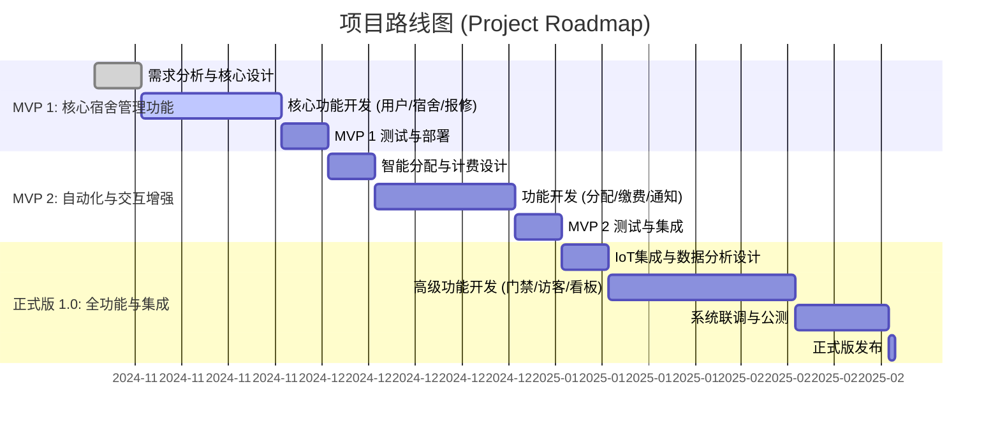

# 智舍宿舍管理系统 — 软件需求规格说明书（SRS）模板

> 用法：按各节提示撰写；所有图请放在 `assignment1/Assignment_1/src/` 下相应子目录，并在文中以相对路径引用。术语、用例编号、角色命名在全篇保持一致。

## 1 Introduction（简介，400–800字）
- 写作目标：概述产品愿景、问题背景、拟解决的核心痛点与价值。
- 内容要点：
  - 背景与动机：高校宿舍管理的现状与痛点（系统割裂、调度低效、数据利用不足）。
  - 项目目标与范围：本系统覆盖的主要场景（分配、报修、费用、安防、数据分析）。
  - 预期用户与受益：学生、宿管、维修、安保、访客。
  - 假设与约束：平台（Web/Electron）、技术栈（TS/React、Go/Gin、PG）、合规与隐私。
- 写作建议：使用陈述语气、避免营销化；首段提出价值主张，末段给出结构预告。

## 2 Strategic Analysis（战略分析）
- 交付物：SWOT 与 TOWS 分析，总结业务目标与举措。
- 写作结构：
  - SWOT：每象限2–4点，聚焦事实与证据（如竞品、资源、风险）。
  - TOWS：从机会/威胁出发，制定SO/WO/ST/WT策略各2–3条。
  - 业务目标与关键举措：用KPI/里程碑表达（如入住率提升、报修SLA）。
- 注意事项：避免空泛，策略要能落到后续路线图与用例上。

## 3 Roadmap（路线图）
本项目采用敏捷迭代的开发模式，将整体目标分解为三个主要阶段：两个最小可行产品（MVP）版本和一个功能完善的正式版。每个阶段都有明确的核心能力、交付成果和验收标准，确保项目方向清晰、风险可控。

- **MVP 1: 核心宿舍管理闭环**
  - **核心能力**: 跑通“学生-管理员”在宿舍管理中的核心业务流程。
  - **交付物**:
    - 学生端：支持登录、查看个人与宿舍信息、提交维修请求。
    - 管理端：支持学生信息管理、宿舍房间管理、维修工单查看与分配。
  - **验收标准**: 学生能成功提交报修，管理员能在后台看到工单并处理；基础数据（学生、宿舍）可被正确增删改查。

- **MVP 2: 自动化与服务扩展**
  - **核心能力**: 引入智能化与自动化工具，提升管理效率与用户体验。
  - **交付物**:
    - 智能分配模块：基于学生画像（如作息、专业）推荐宿舍分配方案。
    - 费用管理模块：支持在线查看水电账单与在线支付。
    - 通知与反馈系统：支持管理员发布公告、学生查看维修进度与评价。
  - **验收标准**: 系统可根据预设规则自动生成宿舍分配建议；学生可完成一次完整的在线缴费流程；维修状态变更后，学生能收到实时更新。

- **正式版 1.0: 全功能智慧宿舍平台**
  - **核心能力**: 集成物联网与数据分析，打造一站式智慧宿舍解决方案。
  - **交付物**:
    - IoT集成：对接智能门禁，实现刷脸/刷卡出入与异常记录。
    - 访客管理系统：支持访客在线预约、审批与临时凭证生成。
    - 数据驾驶舱：为管理者提供宿舍入住率、维修效率、能耗趋势等可视化分析图表。
  - **验收标准**: 授权用户可通过人脸识别进入宿舍；访客可通过预约生成的二维码在规定时间内进入；数据驾驶舱能正确反映各项核心指标。

## 4 Use Case Modelling & Business Process Modelling（用例与业务流程）
- 交付物：
  - 用例图（至少1张，建议整体+子系统分图）。
  - 用例简述：对所有用例给出2–4行文字说明。
  - 详细规格：至少5个用例提供完整规格。
  - 活动图或BPMN：覆盖主业务流程（如“宿舍分配与信息查看”、“维修报修处理”）。
- 图与文件组织：
  - 用例图：`src/UseCaseDiagram/…`；活动图：`src/ActivityDiagram/…`；BPMN：`src/BPMN/…`
- 编写规范：
  - 参与者统一命名：学生、宿管、维修人员、安保、访客、系统管理员。
  - 用例编号：`UC01…UCNN`；示例：`UC01 注册`、`UC02 登录`、`UC03 宿舍信息查看`。
  - 详细用例模板建议字段：
    - 名称/编号/参与者/触发/前置条件/后置条件
    - 主成功场景（编号步骤）
    - 扩展场景（异常/分支）
    - 业务规则与备注
- 注意事项：图与文本一一对应；术语与对象保持一致；避免将实现细节写入用例。

## 5 Glossary of Terms（术语表，≥10项）
- 交付物：表格或列表形式的术语与定义。
- 建议术语（示例）：入住率、调宿、派单、SLA、能耗异常、门禁日志、访客授权、欠费提醒、限界上下文、角色权限。
- 写作建议：定义准确、可被后续用例与非功能性需求引用。

## 6 Supplementary Specification（补充规格）
本章节定义了系统的非功能性需求，这些需求是确保系统质量、性能和用户体验的关键。

| 类别 (Category) | 指标 (Indicator) | 验收标准 (Acceptance Criteria) |
| :--- | :--- | :--- |
| **性能 (Performance)** | **响应时间** | - 核心页面（如登录、主页、信息查看）加载时间 < 2秒。 - 关键操作（如提交报修、查询数据）后台处理响应时间 < 500毫秒。 |
| | **并发用户数** | - 系统在高峰时段（如选房、缴费）能稳定支持至少 500 个并发用户同时在线操作，无明显延迟或服务降级。 |
| **易用性 (Usability)** | **首次使用成功率** | - 新用户在无外部帮助下，首次尝试完成核心任务（如提交报修、查找宿舍信息）的成功率 > 90%。 |
| | **任务完成效率** | - 用户完成高频任务（如缴费、查看通知）的平均点击次数应比传统流程减少 50% 以上。 |
| **可靠性 (Reliability)** | **系统可用性** | - 核心服务年度可用性 > 99.9%，即全年计划外停机时间 < 8.76 小时。 |
| | **容错性** | - 单个非核心微服务（如通知服务）故障不影响核心业务（如登录、报修）的正常运行。 |
| **安全性 (Security)** | **数据安全** | - 所有用户敏感数据（如密码、身份证号）在数据库中必须加密存储。 - 前后端数据传输必须使用 HTTPS/TLS 加密。 |
| | **访问控制** | - 严格遵循基于角色的访问控制（RBAC），任何用户都不能越权访问未授权的接口或数据。 |
| **可维护性 (Maintainability)** | **代码质量** | - 后端 Go 代码单元测试覆盖率 > 70%。 - 前端 TypeScript 代码无编译错误，并通过 ESLint 规范检查。 |
| | **部署效率** | - 基于 Docker 的新版本部署或回滚操作应在 15 分钟内完成。 |
| **可扩展性 (Scalability)** | **架构扩展** | - 系统应支持水平扩展，当用户量增加时，可通过增加服务实例来提升处理能力。 - 新增一种角色（如后勤主管）及其权限配置的开发周期 < 3 人日。 |

## 7 UI Mock-ups（界面快照，≥4张）
- 交付物：至少4张核心界面与简短说明（1–2行/张）。
- 建议页面：登录/注册、宿舍分配、报修工单、费用账单/支付、访客预约。
- 文件与命名：`src/UI/*.png`；命名包含版本与页面，如 `Login_v1.png`。
- 注意事项：保持与用例一致；强调关键交互元素与状态（加载/错误/空态）。

## 8 AI Tools Usage Acknowledgement（可选）
- 如使用AI生成或辅助：说明用途（头脑风暴、图形生成、编辑等）、工具名称与版本、引用方式（直接引用或意译）。
- 注意事项：在参考文献中添加相应引用条目；标注使用范围，避免“全自动”描述。

## 9 References（参考文献）
- 要求：1本领域书籍 和/或 2篇参考文章，每条30–60字简介。
- 格式建议：作者/年份/标题/来源 + 简介（与本项目的关联性与价值）。
- 注意事项：保留原始URL，不更改链接；简介语言客观、可核实。

## 10 Contributions of Team Members（成员贡献）
本文档由智舍团队成员协作完成，各成员的具体分工与贡献如下：

| 姓名 | 学号 | 负责章节 | 主要贡献 |
| :--- | :--- | :--- | :--- |
| **张峻搏** | 2252964 | 3, 6, 10, 全文 | **组长**。负责制定项目路线图（Roadmap），构建非功能性需求框架，并整合团队成员贡献。同时承担全文的统稿、审校与一致性检查工作。 |
| **黄毅成** | 2252634 | 4 | **用例与流程负责人**。负责系统的核心用例建模，绘制了整体用例图，并对关键业务流程（如用户注册、宿舍分配、设备报修等）进行了详细描述和活动图/BPMN建模。 |
| **杨光** | 2251756 | 2, 5, 8, 9 | **战略与术语负责人**。负责项目的战略分析（SWOT/TOWS），定义了项目术语表，整理了参考文献，并撰写了AI工具使用声明。 |
| **马敏慧智** | 2351707 | 1, 7 | **UI与用户价值负责人**。负责撰写项目简介初稿，设计并提供了核心功能的用户界面（UI）快照，并对易用性与无障碍相关的非功能性需求进行了定义。 |

## 11 Agile Artifacts Summary（可选）
- 可总结已采用的敏捷需求工件：Persona、Impact Map、User Journey、Backlog/Theme/Epic/Story、Enabler等。
- 注意事项：只列已完成或在做的工件；附关键截图或链接。

---

交付物清单与路径约定
- 图示与快照统一放置：`assignment1/Assignment_1/src/…`
- Mermaid 图在导出PDF时建议预渲染为SVG/PNG再引用。
- 用例、术语、非功能性需求的术语命名统一，跨章节复用。

任务分配建议（供组长安排）
- 2252964 张峻搏（组长）
  - 负责：3 路线图；6 补充规格整体指标框架；10 成员贡献整合；全文统稿与一致性检查。
  - 产出：路线图文本/或Gantt、非功能性总表、贡献章节、最终版SRS。
- 2252634 黄毅成（用例与流程负责人）
  - 负责：4 用例建模与流程（整体用例图+至少5个详细用例规格+1套活动图/BPMN）。
  - 产出：`src/UseCaseDiagram/*.png`、`src/ActivityDiagram/*.png` 或 `src/BPMN/*.png`、用例文字说明。
- 2251756 杨光（战略与术语负责人）
  - 负责：2 战略分析（SWOT/TOWS与目标）、5 术语表、9 参考文献与30–60字简介、8 AI使用说明（如适用）。
  - 产出：战略分析文本、术语清单表格、规范化参考条目。
- 2351707 马敏慧智（UI与用户价值负责人）
  - 负责：7 界面快照（≥4张，含描述）、1 简介初稿（对齐UI与用例）、部分非功能性需求（易用性与无障碍）。
  - 产出：`src/UI/*.png` 与说明、简介文本、易用性规范。
- 协作节奏（建议）：
  - 10/27 提交各自第一版产出；10/29 完成交叉评审与修订；10/31 组长统稿；11/1 全文终审并准备提交。
- 统一规范：
  - 用例编号、术语命名、角色名称在全篇保持一致；图与文本互相引用。
  - 图片统一PNG，分辨率 1600×900 以上；文件名包含页面与版本。